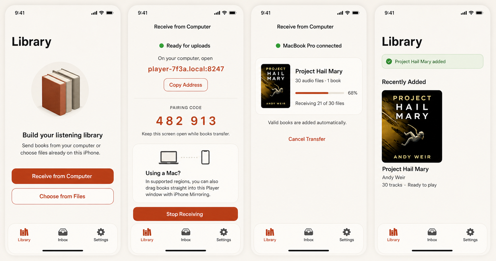
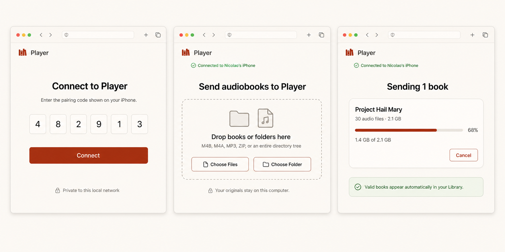

# Direct Import UX

Status: interaction specification
Last updated: 2026-08-22
Related architecture: [DIRECT_IMPORT_ALTERNATIVES.md](DIRECT_IMPORT_ALTERNATIVES.md)

## Product decision

`Receive from Computer` is the primary direct-import experience in every
country and on every supported desktop platform. Player hosts a private upload
page on the local network while the receiver screen is open. The listener opens
that page on a computer, drags a book, folder tree, or ZIP onto it, and Player
adds valid books to Library automatically.

iPhone Mirroring is an optional Mac shortcut, not a primary or required route.
When Apple makes Mirroring available in the listener's region, the receiver
screen explains that the same files can be dragged directly onto the mirrored
Player window. That card is absent in the European Union and whenever regional
eligibility is unknown.

## Build 7 implementation scope

Build 7 ships the primary end-to-end path specified here and hardens the
real-device behavior first introduced in Build 6:

- explicit `Receive from Computer` discovery in an empty or populated Library;
- an on-device local HTTP receiver with Bonjour advertisement, a per-session
  six-digit pairing code, and a random bearer credential;
- a bundled plain Svelte uploader with no hosted or third-party runtime;
- one-drag or one-picker upload of audio files, a book folder, a directory tree,
  or one ZIP, with relative paths and byte progress preserved;
- automatic Library commit for a warning-free import and an explicit Inbox
  handoff when the existing importer requires review;
- the region-gated iPhone Mirroring explanation and a native drop target;
- free-space preflight, safe path validation, partial-transfer cancellation,
  and launch/stop/success cleanup of app-owned transport copies; and
- single-storage ingestion for receiver-owned files by adopting them into
  durable staging with same-volume hard links, so a received audiobook is not
  physically copied a second time before inspection;
- matching decimal byte units, server-confirmed browser progress, durable
  import tasks that outlive an HTTP request or receiver screen, and retry that
  keeps a valid paired browser session alive; and
- deterministic native UI coverage plus an end-to-end HTTP integration test.

The Handoff shortcut, wired Finder/Apple Devices drop box, trusted-computer
credentials, resumable chunk offsets, multi-selection queuing, remote region
policy, and user-configurable automatic-add setting remain follow-up work. Those
sections below specify the intended evolution; they are not claims about Build
7. The primary web route does not depend on them.

## Build 9 Mirroring completion scope

Build 9 replaces Build 8's SwiftUI-only drop registration, which physical
iPhone Mirroring did not expose as a Finder destination, with a UIKit
`UIDropInteraction` installed on the active app window. The production
item-provider ingress adapter remains behind that native entry point. While
`Receive from Computer` is open, it:

- accepts Finder-provided M4B, M4A, MP3, ZIP, file URL, and folder
  representations;
- recursively materializes audio from folder trees without flattening their
  relative paths;
- tries an in-place representation first, falls back to a temporary provider
  representation, and uses same-volume hard links before streaming a copy;
- rejects symbolic links, canonical path collisions, overlarge trees, and a
  ZIP mixed with other dropped items;
- cancels the provider operation and removes the whole app-owned drop session
  when the listener closes the screen;
- hands the completed selection to the same real automatic importer used by
  the web receiver; and
- removes transport files after the importer has adopted durable media.

Synthetic `NSItemProvider` tests cover individual files, recursive folders,
unsafe links, ZIP-selection rules, cancellation, cleanup, and the complete
folder-to-Library pipeline. A native-interaction lifecycle test covers window
registration and removal. The deterministic UI story covers the visible
Mirroring progress state. Apple's actual Mac-to-iPhone Mirroring transport
cannot be created by Simulator, so single-file, folder, multi-file, ZIP, and
large-tree drags on physical hardware remain the release gate for this route.

## Build 10 stability follow-up

Build 10 fixes two crashes observed in Build 9 on physical hardware. Removing
the Mirroring interaction no longer writes through its SwiftUI binding while
SwiftUI is dismantling the view. Now Playing artwork is also supplied through
a nonisolated, immutable provider because MediaPlayer requests artwork on its
private background queue. Regression coverage runs both fixes on Simulator and
on a connected iPhone; the normal import and playback walkthroughs remain part
of the release gate.

The listener must never be told to:

- save the uploaded files into Files and select them again;
- open Inbox and press Add for a warning-free import;
- unzip a valid archive manually;
- clean an upload directory after success; or
- configure an iPhone folder before the first web import.

## Mockups

### iPhone discovery, receiver, transfer, and Library result



### Computer pairing, drop target, and upload progress



The mockups define hierarchy, states, palette, and primary copy. They are design
artifacts rather than exact-pixel test baselines. Native safe-area dimensions,
Dynamic Type reflow, localized copy, the current tab bar, and system permission
alerts take precedence during implementation.

## Success definition

A direct import is successful when:

1. the computer reports that all selected bytes were sent;
2. Player verifies and groups the complete selection;
3. every warning-free proposal commits without another user decision;
4. the resulting books are visible in Library;
5. the computer originals remain unchanged; and
6. no upload, handoff, ZIP, extraction, or staging copy remains on the phone.

One directory-tree drag is one import even when it contains many books. Valid
books commit independently if another book in the tree has a blocking problem.

## Meaning of "one action"

The import action itself is one drag or one file/folder selection on the
computer. Starting a secure local receiver and granting the one-time iOS Local
Network permission are session/setup actions, not repeated file-copy steps.

| Situation | Listener actions |
| --- | --- |
| First web import | Open Player; tap Receive from Computer; tap Allow on Apple's Local Network alert; open the displayed address on the computer; enter the displayed code; drag the source |
| Later web import | Open Player; tap Receive from Computer; open or resume the receiver page; enter the new session code; drag the source |
| Another import in the same active session | Drag the next source |
| Supported-region iPhone Mirroring | Open Player in iPhone Mirroring; open Receive from Computer; drag the source onto the mirrored window |
| Finder/Apple Devices fallback | Drag the source into Player's Import Drop Box; open Player now or later |

There is no supported way for a purely local iOS receiver to accept a new
inbound connection while Player is suspended indefinitely. The UI says `Keep
this screen open while books transfer` and pauses cleanly rather than implying
otherwise.

## Discovery

### Empty Library

The empty Library replaces the single `Add Audiobook` action with two explicit
choices:

```text
Build your listening library
Send books from your computer or choose files already on this iPhone.

[ Receive from Computer ]   filled primary
[ Choose from Files ]       bordered secondary
```

`Receive from Computer` is visually primary. `Choose from Files` retains the
existing document picker behavior.

Accessibility identifiers:

- `receive-from-computer-empty-library`
- `choose-from-files-empty-library`

### Populated Library

The existing Add toolbar action remains. Tapping it opens a native source sheet
titled `Add Audiobooks` with this order:

1. `Receive from Computer`
   - symbol: `laptopcomputer.and.iphone`
   - detail: `Open a private upload page on this network.`
2. `Choose from Files`
   - symbol: `folder`
   - detail: `Select files, folders, or a ZIP on this iPhone.`
3. `Import Drop Box Help`
   - symbol: `cable.connector`
   - detail: `Transfer large libraries with Finder or Apple Devices.`
4. `Cancel`

The sheet does not mention iPhone Mirroring. Mirroring appears only after the
listener chooses the computer-receive path, where its context and regional
limitations can be explained.

Accessibility identifiers:

- `add-audiobooks`
- `receive-from-computer-source`
- `choose-from-files-source`
- `import-drop-box-help`

### Inbox

An empty Inbox may show a secondary `Receive from Computer` button below its
empty-state explanation. Existing processing or failure lists are not displaced
by receiver promotion.

### Settings

Settings includes:

```text
Imports
  Receive from Computer
  Import Drop Box Help
  Automatically add valid imports     On
```

The automatic-add setting defaults on. Turning it off sends completed proposals
to the existing review flow; it is an advanced preference, not onboarding.

## Starting the receiver on iPhone

### First launch and Local Network permission

Tapping `Receive from Computer` pushes the receiver screen and immediately asks
the receiver service to start. On first use, iOS presents its Local Network
permission alert using this `NSLocalNetworkUsageDescription`:

> Player uses your local network to receive audiobooks directly from your
> computer.

Player does not show a look-alike permission pre-prompt. The visible receiver
screen supplies context behind the system alert.

If the listener taps Allow, Player continues into `Ready for uploads`. If they
tap Don't Allow, Player shows the denied state specified below; it does not fall
back silently to a public Internet service.

### Starting state

While Player is connecting to Wi-Fi and binding its local listener:

```text
Receive from Computer
Starting receiver…
This usually takes a moment.
```

If startup lasts longer than five seconds, show `Connection Help` without
replacing the progress state.

### Ready state

The first viewport contains, in order:

1. inline navigation title `Receive from Computer`;
2. green status dot and `Ready for uploads`;
3. instruction `On your computer, open`;
4. the local address in a selectable monospaced field;
5. `Copy Address`;
6. section label `PAIRING CODE`;
7. the six-digit code grouped as `482 913`;
8. `Keep this screen open while books transfer.`;
9. the conditional Mirroring card, if eligible; and
10. `Stop Receiving`.

Example address:

```text
player-7f3a.local:8247
```

The production hostname suffix is stable per installation when possible; the
port may vary. `Connection Help` exposes a numeric IPv4/IPv6 address if mDNS
resolution fails. The numeric address is not placed in the primary viewport.

The pairing code:

- is six decimal digits with leading zeroes allowed;
- is randomly generated for each receiver session;
- expires after ten minutes without a successful connection;
- is invalidated after five failed attempts from one client;
- is replaced after the receiver stops; and
- is never written to analytics or persistent logs.

Accessibility identifiers:

- `computer-receiver-screen`
- `computer-receiver-status`
- `computer-receiver-address`
- `copy-computer-receiver-address`
- `computer-receiver-pairing-code`
- `computer-receiver-help`
- `stop-computer-receiver`

VoiceOver reads the code as six individual digits, not as a six-digit number.

### Handoff discovery on Mac

While the receiver is ready, Player publishes an eligible `NSUserActivity` for
the local receiver URL. When Handoff is available, a compact help row says:

> On a Mac, open Player from Handoff in the Dock.

Choosing the Handoff activity opens the same local web page. Handoff is an
address-discovery shortcut only; the browser still pairs with the phone unless
the Handoff URL contains a short-lived single-use session credential.

If a credential is embedded, it must:

- expire within two minutes;
- be accepted only once;
- be removed from browser history with `history.replaceState` immediately after
  exchange; and
- never appear in page analytics or server logs.

## Regional iPhone Mirroring card

### Placement and copy

The Mirroring card appears below the pairing instruction and above `Stop
Receiving`, so it is discoverable but subordinate to the global web flow.

```text
Using a Mac?
In supported regions, you can also drag books straight into this Player window
with iPhone Mirroring.
```

The card uses `laptopcomputer` and `iphone` symbols joined by a dotted transfer
line. It is informational, not a primary button. An optional `Requirements` link
opens an in-app explanation of supported OS versions, same-Apple-Account setup,
proximity, and Apple's current regional availability page.

### Eligibility policy

iOS does not expose a definitive public `isIPhoneMirroringAvailable` API to the
app. This card is therefore product guidance, not a capability detector.

The card is shown only when all of these are true:

1. a remotely maintainable region policy marks the resolved region supported;
2. the resolved region is not one of the 27 European Union member states;
3. the remote kill switch is not active; and
4. the app can render the localized requirements copy.

Resolve the merchandising region without requesting location permission:

1. App Store storefront country code when available;
2. device region as a fallback; and
3. unknown when neither is available.

Unknown fails closed: hide the card. A shipped EU denylist protects offline
behavior; remote configuration can add or remove supported regions as Apple
changes availability. The web receiver remains unchanged and primary in every
case.

Do not display a disabled card saying `Unavailable in your region`. Users in
unsupported regions see the complete web flow without a missing-feature
message.

### Drag behavior through Mirroring

When a file drag enters the mirrored Player window, the receiver screen becomes
a full-window drop target:

```text
Drop to import
Books, folders, audio files, or ZIPs
```

Dropping starts a direct-import session using the item-provider transport. It
does not send those bytes through the local HTTP server and does not require the
pairing code. The receiver screen identifies the item being materialized, shows
provider-item progress, and then changes to the shared checking/import result
states.

If the provider cannot vend a folder recursively, show:

> This Mac could not provide the folder contents. Zip the folder or use the web
> uploader shown on this screen.

The web address and code remain available as the reliable fallback.

## Computer web experience

The upload application is bundled in Player and served entirely from the phone.
It has no third-party scripts, fonts, analytics, trackers, or Internet
dependencies.

### Opening the page

The listener uses one of:

- type the displayed `.local` address;
- tap `Copy Address` and send/paste it using their preferred continuity method;
- choose Player through Handoff on a Mac; or
- use the numeric address in Connection Help if `.local` does not resolve.

If the page cannot contact Player, it says:

> Player could not be reached. Keep Receive from Computer open on your iPhone
> and make sure both devices are on the same local network.

Actions are `Try Again` and `Connection Help`.

### Pairing page

Before authentication, the browser exposes no file list, device metadata, or
upload endpoint. Its page contains:

```text
Player

Connect to Player
Enter the pairing code shown on your iPhone.

[ _ ] [ _ ] [ _ ] [ _ ] [ _ ] [ _ ]
[ Connect ]

Private to this local network
```

Behavior:

- numeric input advances automatically but supports paste of all six digits;
- Backspace moves to the preceding box when empty;
- Return submits once all digits exist;
- an invalid code says `That code did not match. Check Player and try again.`;
- an expired code says `That code expired. Restart Receive from Computer for a
  new code.`; and
- successful pairing replaces the browser URL so the code is absent from
  history.

The MVP pairs once per receiver session. A future `Trust this computer` feature
may store a cryptographic device credential, but it is not required for the
first release and must include a visible `Forget paired computers` control.

### Ready uploader

After pairing:

```text
Player
Connected to <device name>

Send audiobooks to Player

Drop books or folders here
M4B, M4A, MP3, ZIP, or an entire directory tree

[ Choose Files ] [ Choose Folder ]

Your originals stay on this computer.
```

The full central card is a drop target. `Choose Files` accepts multiple audio
files or one ZIP. `Choose Folder` invokes the browser's directory picker and
preserves every relative path beneath the chosen folder.

The browser rejects an unsupported extension before upload and names the
unsupported item. Hidden files, macOS resource forks, `.DS_Store`, and supported
audio-sidecar noise are ignored according to the importer contract rather than
presented as failures.

### Preflight

Before sending bytes, the browser enumerates the complete selection and sends a
manifest containing relative paths and byte counts. Player returns one of:

- `accepted` with upload offsets;
- `insufficient storage` with required and available space;
- `too many entries`;
- `unsupported selection`; or
- `conflicting active session`.

Preflight does not promise that audio or ZIP contents are valid. It prevents a
known-impossible transfer before consuming bandwidth or phone storage.

### Uploading

The browser and phone show the same source name, file count, total bytes,
completed bytes, and progress fraction.

Browser example:

```text
Sending 1 book

Project Hail Mary
30 audio files · 2.1 GB
[==================--------] 68%
1.4 GB of 2.1 GB

[ Cancel ]

Valid books appear automatically in your Library.
```

Phone example:

```text
MacBook Pro connected

Project Hail Mary
30 audio files · 1 book
[=============-------] 68%
Receiving 21 of 30 files

Valid books are added automatically.
[ Cancel Transfer ]
```

Progress is based on acknowledged persisted bytes, not bytes merely read by the
browser. Rate and time remaining may appear only after a stable estimate exists.

Dragging a second source while one is uploading adds it to a visible queue. It
does not merge the two top-level selections into one grouping decision.

### Upload complete and import processing

Once all bytes and checksums match, the browser changes from transfer progress
to:

```text
Upload complete
Player is checking 30 files and adding valid books to your Library.
```

Player changes the phone card from `Receiving` to the existing import phases:

- `Checking files`;
- `Reading book details`;
- `Organizing tracks`; and
- `Adding to Library`.

The browser receives phase updates over the active session but does not need to
stay open after it reports `Upload complete`. Closing the browser never cancels
a sealed transfer.

### Successful completion

For one book:

```text
Project Hail Mary added
30 tracks · Ready to play
```

For a tree:

```text
12 books added
428 tracks · Ready to play
```

The books already exist in Library when this message appears. There is no Add
button. The phone automatically presents Library with a transient success banner
after the current top-level selection finishes. The receiver stops after that
selection unless another selection is already queued; this limits the exposure
of an unattended listener. `Receive from Computer` can be started again at any
time.

The browser shows `Sent to Player` and may be closed. It must not tell the user
to finish the import on the phone when every proposal committed successfully.

### Mixed completion

If a directory contains valid and blocked books:

```text
11 books added · 1 needs attention
The valid books are in your Library. Open Inbox when you are ready to fix the
remaining book.
```

The phone presents Library, displays the success count, and badges Inbox once.
The listener is not forced into Inbox.

## Failure and recovery copy

| Condition | iPhone copy | Primary action |
| --- | --- | --- |
| Local Network denied | `Local Network Access is Off. Allow access so Player can receive books directly from your computer.` | `Open Settings` |
| No usable local interface | `Connect this iPhone and your computer to the same local network, then try again.` | `Try Again` |
| Address not reachable | `Player could not be reached. Keep Receive from Computer open and check the network.` | `Try Again` |
| Invalid pairing code | `That code did not match.` | Re-enter code |
| Receiver backgrounded before sealing | `Transfer paused. Reopen Receive from Computer to continue.` | `Resume Receiving` |
| Browser disconnected | `Connection lost. Waiting for the computer to reconnect…` | `Cancel Transfer` |
| Insufficient storage | `This import needs <required>, but <available> is available.` | `Manage Storage` |
| Unsafe ZIP | Existing precise ZIP safety explanation; original remains unchanged | `Dismiss` or `Change Selection` |
| Unsupported files only | `No supported audiobook files were found.` | `Choose Another Source` |
| Cancelled before seal | `Transfer cancelled. Partial files were removed.` | `Done` |

Retry resumes verified chunk offsets. It never restarts files whose checksum is
already durable. Cancel removes app-owned partials and receipts but never sends a
delete command to the computer source.

## Session lifetime

- Receiver starts only after the user chooses `Receive from Computer`.
- An unpaired ready receiver expires after ten idle minutes.
- A paired but idle receiver expires after fifteen minutes.
- Active byte transfer prevents idle expiry.
- The iPhone idle timer is disabled only while the receiver screen is visible
  and a transfer is active.
- Leaving Player pauses new inbound reads. A transfer already sealed continues
  through the durable local import pipeline when iOS execution time permits and
  resumes on next launch otherwise.
- `Stop Receiving` closes the listener, invalidates credentials, and cancels
  unsealed transfers after confirmation. It does not cancel a sealed import.

Stop confirmation:

> Stop receiving from this computer?
>
> The current transfer will pause. Files already added to your Library are not
> affected.

Actions: `Keep Receiving`, `Stop and Clean Up`.

## Privacy and trust language

Use precise claims:

- `Private to this local network` means the web page is served by the phone and
  is not a public Player service.
- `Your originals stay on this computer` means Player reads/uploads without
  modifying or deleting the source.
- Do not claim end-to-end encryption if the first implementation uses plain
  local HTTP. Pairing prevents unsolicited upload but does not itself make the
  byte stream confidential from passive network observation.
- The page contains no analytics. Product metrics are recorded on-device and,
  if the listener has consented to diagnostics, upload only aggregate route and
  outcome values without filenames, titles, paths, IP addresses, pairing codes,
  or checksums.

If transport encryption is added, change the status to `Private encrypted
connection` only after the authenticated channel is established.

## Accessibility

### iPhone

- Buttons remain at least 44 points; primary actions target 52 points.
- Pair-code digits are one accessibility element with a digit-by-digit value.
- Progress announces milestones at 0, 25, 50, 75, and 100 percent, plus phase
  changes; it does not announce every chunk.
- Status never depends on green, amber, or red alone; icon and text accompany it.
- At accessibility sizes, the address, Copy button, code, Mirroring card, and
  Stop action stack vertically and scroll.
- The full-window Mirroring drop target also has a visible `Choose from Files`
  fallback for switch-control users.

### Browser

- Pairing uses one labeled group and supports paste.
- The drop zone is a real keyboard-focusable control with ARIA instructions.
- `Choose Files` and `Choose Folder` are always available; drag is never the
  only input method.
- Each transfer exposes a named `<progress>` element and a textual byte count.
- Errors move focus to an alert without discarding the selected manifest.
- Reduced-motion preference removes pulsing receiver and progress animations.
- The layout remains usable at 200% zoom and on a 1024-pixel-wide desktop.

## Localization

Geographic Mirroring eligibility and language localization are separate:

- every receiver and uploader string is localized in every supported app
  language;
- the Mirroring card appears based on regional availability, not UI language;
- changing the app language never bypasses the EU denylist; and
- changing device region may change merchandising guidance but never disables
  the globally available web receiver.

Addresses, pairing digits, byte units, and decimal separators use locale-aware
formatting without altering protocol values.

## UI state model

```text
idle
  -> requestingLocalNetwork
  -> starting
  -> ready(code, address)
  -> paired(client)
  -> receiving(manifest, progress)
  -> sealed(receipt)
  -> inspecting(job)
  -> committing(job)
  -> completed(result)

requestingLocalNetwork -> denied
starting -> unavailable
ready | paired | receiving -> paused
receiving -> cancelled
sealed | inspecting | committing -> recoverableFailure | blockedFailure
```

Transport state and import-job state remain separate. The browser may disconnect
after `sealed`; the import job continues. Reconnecting with the receipt ID shows
the current durable result without creating a second job.

## Implementation boundaries

Suggested production components:

- `DirectImportCoordinator`: sealed manifests, receipts, automatic policy, and
  cleanup ownership;
- `ComputerReceiver`: `NWListener`, session lifetime, pairing, and connections;
- `ReceiverWebApp`: bundled HTML/CSS/JavaScript assets;
- `ResumableUploadStore`: partial chunks, offsets, checksums, and atomic seal;
- `ComputerReceiverView`: iPhone ready/progress/error states;
- `MirroringDropAdapter`: item providers into the same manifest contract;
- `MirroringTipPolicy`: shipped denylist plus remotely maintainable regional
  availability; and
- existing `PlayerModel`: analyze, group, inspect, commit, and Library updates.

No view writes directly to Staging or Media. The web server and Mirroring adapter
produce transport entries; only the coordinator seals them and starts import.

## Test and release contract

### Automated tests

- every receiver state renders with exact accessibility values;
- pairing accepts typing and paste, rejects replay, rate-limits failures, and
  expires correctly;
- directory paths survive browser traversal without flattening;
- upload resumes from acknowledged offsets after connection loss;
- closing the browser after seal does not cancel import;
- valid direct imports auto-commit without an Add action;
- mixed trees add valid books and badge only blocked books;
- cancellation and success satisfy the no-extra-copy storage inventory;
- synthetic item providers preserve recursive folder paths and complete the
  real folder-to-Library importer;
- unsafe links, canonical collisions, mixed ZIP selections, and cancelled
  provider operations remove every partial Mirroring session;
- EU/unknown region policies hide the Mirroring card;
- a supported-region policy shows the Mirroring card without displacing the web
  address, pairing code, or Stop action; and
- remote kill switch hides the card immediately after policy refresh.

### Physical-device tests

- iPhone and Mac on ordinary home Wi-Fi;
- iPhone and Windows through Apple Devices plus browser upload;
- IPv6-only local network;
- VPN active and inactive;
- guest Wi-Fi/client isolation failure copy;
- screen lock and app background during a large upload;
- Handoff opening the correct ephemeral receiver;
- Mirroring drag in a supported non-EU region;
- EU-region configuration with no Mirroring promotion;
- single M4B, book folder, multi-book tree, multifile selection, and ZIP; and
- a transfer larger than available storage.

### Exact E2E visual story

`tests/e2e/001-ios-launch` now includes canonical empty-Library discovery,
receiver-ready, region-eligible Mirroring guidance, and native Mirroring
preparation-progress screens. A future receiver-specific story should add web
transfer progress, automatic completion, and blocked-item states.

The web uploader receives browser-level snapshot and accessibility tests rather
than being rasterized inside the iOS exact-pixel story.
