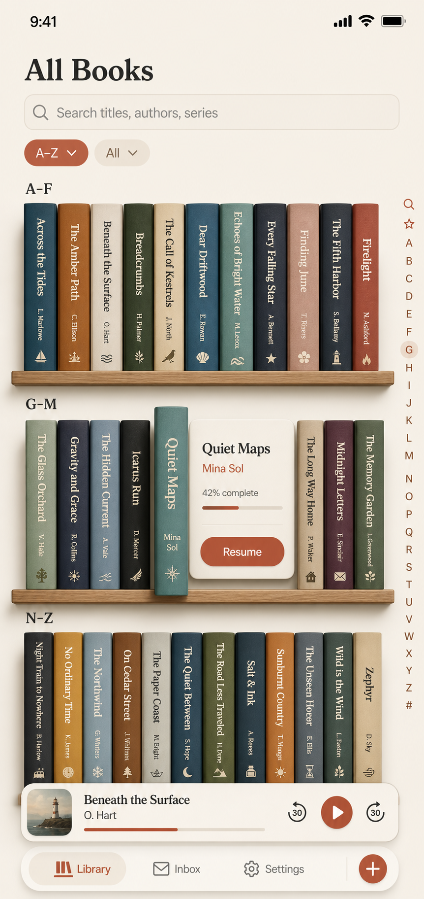
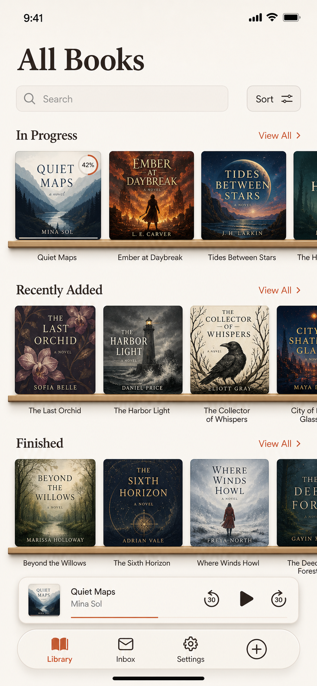
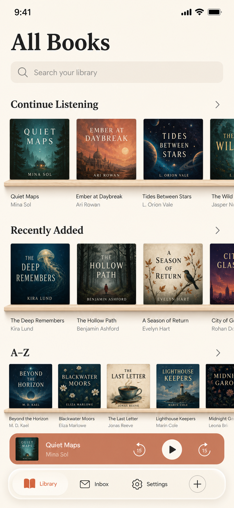
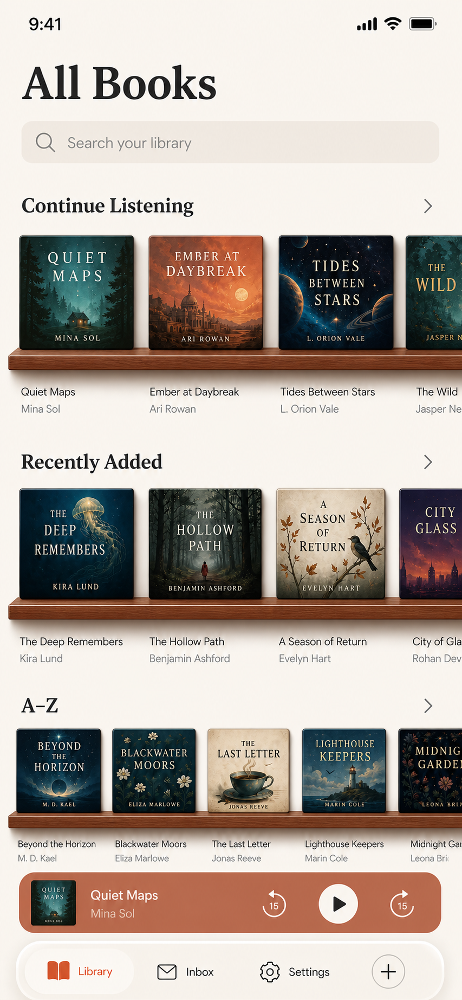

# Bookshelf concept for All Books

Status: concept exploration, not an implementation commitment  
Target: iPhone portrait, with iPad adaptation considered  
Scope: the **All Books** destination only

## Intent

All Books offers efficient shelf and list presentations, but both make
the collection feel like a database of square cover images. This concept tests a
more spatial library metaphor: audiobooks stand upright on shelves, primarily as
spines, so browsing feels like looking across a personal bookcase.

The metaphor should add recognition and delight without giving up search, sort,
progress, accessibility, or fast navigation through a large collection. The
rest of Library can keep its task-oriented cards and lists; this is a distinctive
browsing mode for the complete collection.

## Concept A — curated shelves

This version groups volumes into meaningful shelves such as **Recently Added**,
**In Progress**, and **Finished**. Most books appear spine-out while one book on
each shelf may face forward as an endcap. The endcap gives cover art a role
without returning to a flat cover grid.

Strengths:

- The shelf names provide immediate orientation and reinforce listening state.
- Varied spine widths make the collection feel personal and visually memorable.
- Cover-out endcaps create strong targets for featured or recently active books.
- The layout works naturally with horizontal shelf scrolling and vertical page
  scrolling.

Risks:

- A book may qualify for more than one shelf, so this presentation is not a
  literal one-copy inventory.
- Spine text needs a minimum usable width; very dense shelves cannot rely on
  rendered title text alone.
- Progress and secondary metadata are intentionally quiet until selection.

## Concept B — compact A–Z stacks

This version emphasizes collection scale. Narrow spines are grouped into broad
alphabet ranges, with an alphabet scrubber for long-distance navigation. Tapping
a spine pulls it forward and reveals a compact card with title, contributor,
progress, and the next action.

Strengths:

- More books fit on screen than in a conventional cover grid.
- Alphabet ranges and the scrubber make the arrangement predictable.
- The pulled-forward card provides readable details without navigating away.
- Selection is explicit, leaving room for a larger second tap target such as
  **Resume** or **Open Book**.

Risks:

- Narrow spines are harder to target and scan, especially with long titles.
- The alphabet scrubber competes with the system back-swipe and scroll edges.
- The selection card can cause shelf reflow unless its space is reserved.

## Concept C — cover ledges

This version keeps the physical shelf cue but makes cover art the primary object.
Each named shelf is an ordinary horizontal carousel whose items rest on a thin
decorative ledge. It is substantially closer to Bookshelf's current data and view
architecture than rendered spines: existing artwork, title, progress, and tap
behavior can be reused while the shelf supplies grouping and depth.

The generated image leans toward print-book jacket proportions even though the
product target is square artwork. Treat it as a composition and art-direction
reference, not an aspect-ratio specification.

## Concept D — square audiobook shelves

This is the implementation target. Every production cover is a strict 1:1 tile
in a horizontal `ScrollView`, with a caption below and a light ledge behind the
bottom edge. A partial final tile communicates horizontal scrolling. Existing
sections such as Continue Listening and Recently Added map directly to shelves,
and A–Z provides a predictable route to the complete collection.

Strengths:

- Uses the square artwork Bookshelf already stores and renders.
- Can be built from native stacks, lazy containers, and scroll views without
  synthesizing spine art or rotating text.
- Keeps titles readable and preserves familiar artwork recognition.
- Shelf grouping remains visually distinct from a conventional flat cover grid.

Risks:

- Fewer books fit on screen than with narrow spines.
- Multiple horizontal carousels require clear scroll affordances and careful
  VoiceOver ordering.
- The ledge must remain quiet enough that it does not compete with cover art.

## Concept E — burnt-orange wood shelves

This revision keeps Concept D's implementation-friendly structure while making
the physical metaphor more intentional. Strictly square audiobook cases rest on
a reddish walnut ledge derived from Bookshelf's burnt-orange accent. A darker front
lip, fine grain, and restrained top highlight give the shelf depth without
turning it into decorative furniture. Soft contact and right-edge shadows make
each cover feel like a thin case sitting on the shelf rather than a flat image
floating above a divider.

Production uses a purpose-built, true-alpha reddish-walnut image asset for the
ledge so that its fine grain, highlight, bevel, and contact shadow survive the
translation from mockup to the native app. Three Retina resolutions keep the
material crisp, while the asset remains horizontally resizable for different
screen widths. Cover gloss, edge depth, and case shadows remain native effects
so they can respond to accessibility settings.

## Recommended direction

Prototype Concept E first. It preserves Concept D's practical square-cover
geometry while tying the shelf material directly to Bookshelf's visual language.
Concept A and B
remain useful long-term explorations for a more literal personal-bookcase mode;
they should not block the practical square-cover prototype. Concept C supplies
the strongest original shelf styling reference, Concept D defines production
geometry, and Concept E defines the production color and depth treatment.

The first prototype should use these rules:

1. A shelf is a horizontal collection with a visible text heading and a quiet
   full-width ledge. The page scrolls vertically; each shelf may scroll
   horizontally.
2. Every book has a minimum 44-point hit region even when its visible spine is
   narrower. Adjacent hit regions must not overlap.
3. Production artwork remains square and uses the existing cover fallback when
   art is unavailable. Never crop a square cover into a simulated print jacket.
4. A tap opens Book Detail. Continue Listening may retain its explicit Resume
   affordance and progress line without requiring a selection mode.
5. Search filters books in place and removes empty shelves. Sort controls may
   replace the curated grouping with Title, Author, Recent, or Progress shelves.
6. The mini-player and bottom navigation remain floating system surfaces. The
   scroll view must reserve enough bottom runway to raise the final shelf fully
   above both.
7. Continue Listening and Recently Added show about 3.5 square cases in one
   viewport. The denser A–Z shelf shows about 4.8. Case corners are deliberately
   tight, with a narrow gloss and right edge that reads as physical depth.

## Accessibility and fallback

The visible bookshelf is one rendering of a semantic collection, not the
accessibility structure itself. VoiceOver should encounter a conventional,
ordered sequence of books grouped by named shelf. Each element announces title,
contributor, progress, shelf, and available action; decorative shelf ledges are
hidden.

At accessibility text sizes, horizontal spine labels should not attempt to scale
indefinitely. Prefer a selected-book detail card with full Dynamic Type support,
and offer the existing list presentation as a persistent view preference. Reduce
Motion should replace pull-forward depth animation with a short opacity and
outline transition. Increase Contrast should strengthen spine boundaries and
selected-state outlines.

## Validation questions

- Can listeners identify a known book faster than in a conventional cover grid?
- Does a shelf remain useful with 3, 30, 300, and 3,000 books?
- Are duplicate appearances across curated shelves helpful or confusing?
- Is one-tap selection plus an explicit action preferable to opening immediately?
- Can all books be reached with VoiceOver, Switch Control, keyboard navigation,
  and the largest Dynamic Type setting?
- Does the last shelf always clear the mini-player and navigation pill?

## Mockup note

These images are generated concept artifacts. Book art, typography, exact
spacing, and rendered titles are illustrative; implementation should use Bookshelf's
design tokens, real metadata, native controls, and tested accessibility labels.
