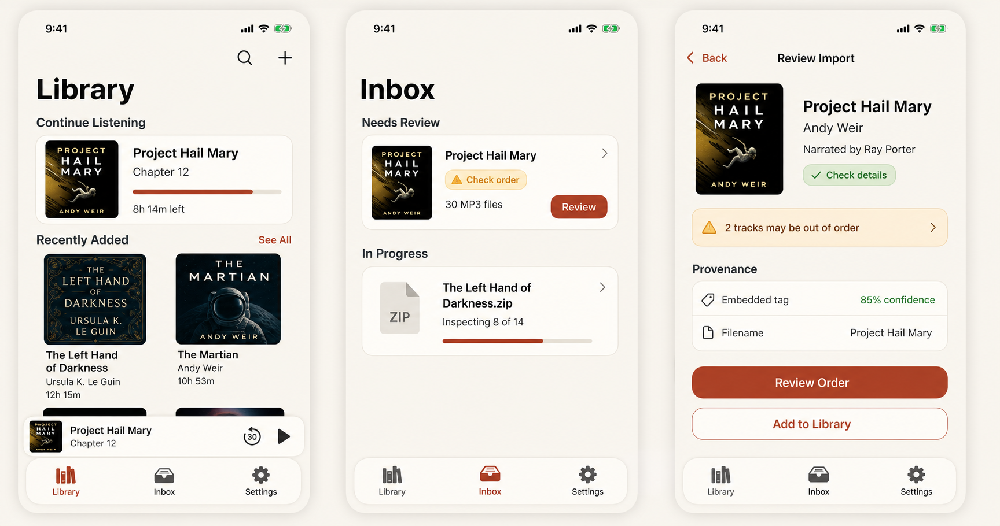
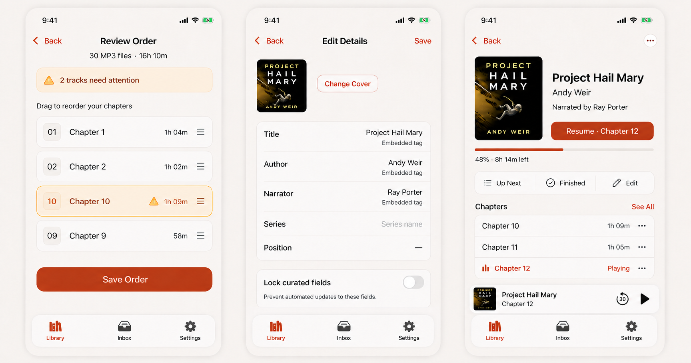
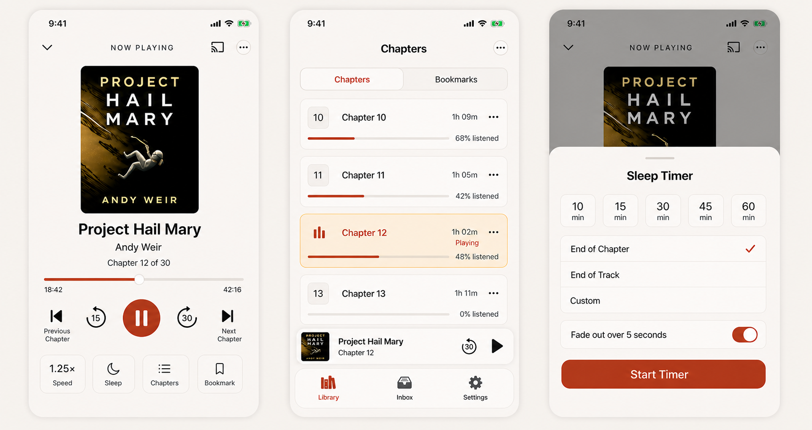

# UX design specification

## Purpose and authority

This document translates [VISION.md](VISION.md) and [MVP_DESIGN.md](MVP_DESIGN.md) into an implementation-facing interaction and visual system for the iPhone MVP. It defines hierarchy, navigation, components, behavior, copy, accessibility, and screen states.

When sources differ, use this order:

1. Safety, accessibility, and data-integrity requirements in `MVP_DESIGN.md`.
2. Interaction and component rules in this document.
3. Mockups for composition, density, and visual tone.

The mockups are directional raster references, not screenshot-test baselines. Generated text, icons, covers, and fine geometry must be implemented with native SwiftUI, semantic type, SF Symbols, and the exact states specified here. Audiobook covers shown in mockups are illustrative; committed test fixtures must use licensed or synthetic artwork.

## Mockup set

### Library, Inbox, and import review



This board establishes the root navigation, library density, mini-player, observable import queue, warning treatment, provenance, and commit hierarchy.

### Order repair, metadata editing, and book detail



This board establishes progressive repair: show the problem, let the listener correct only what is uncertain, then return to a trustworthy book object.

### Now Playing, chapters, and sleep timer



This board establishes the listening hierarchy, explicit chapter context, audiobook-specific transport controls, supporting actions, and modal behavior.

## Product posture

Bookshelf should feel like a quiet personal library, not a music service or file manager.

- **Calm:** one strong action per state, restrained decoration, no engagement feed.
- **Legible:** meaningful type hierarchy, plain labels, generous targets, visible state.
- **Book-first:** covers and bibliographic relationships are prominent; source files recede until repair is needed.
- **Trustworthy:** progress, provenance, warnings, undo, and source-file safety are explicit.
- **Native:** standard navigation, sheets, menus, pickers, context menus, accessibility behavior, and haptics.
- **Local:** no account avatar, cloud badge, network-dependent skeleton, or storefront treatment in the MVP.

## Experience architecture

### Root navigation

```text
TabView
├── Library
│   ├── Search / All Books / Series / Authors / Narrators / Collections
│   ├── Book Detail
│   └── Now Playing (full-screen cover)
├── Inbox
│   ├── Review Import
│   ├── Review Order
│   └── Edit Details
└── Settings
    ├── Playback
    ├── Library
    ├── Storage
    ├── Backup
    ├── Accessibility
    └── About & Diagnostics
```

Now Playing is presented as a full-screen cover from the mini-player or a Play/Resume action. Review flows stay in the Inbox navigation stack. Editing an already committed book uses the same editor model but returns to Book Detail.

### Tab behavior

- Tabs are `Library`, `Inbox`, and `Settings`, in that order.
- Each tab retains its navigation path during the current session.
- Relaunch opens Library unless a share-sheet import is pending.
- Inbox receives a numeric badge only for items requiring action. Background processing without required action uses a progress indicator, not a count.
- A current book produces a mini-player directly above the tab bar on every root tab.
- The mini-player is absent when no book has ever played, after the current book is removed, and while full Now Playing is visible.

### Primary journeys

#### First book

```text
Empty Library → Add Audiobook → Files → Inbox progress
→ Review Import → optional Review Order/Edit Details
→ Add to Library → Book Detail → Play
```

#### Return to listening

```text
Launch → Continue Listening → Book Detail or mini-player
→ Now Playing → Smart Rewind → playback
```

#### Repair an uncertain import

```text
Inbox warning → Review Import → warning row
→ Review Order → Save Order → Review Import
→ Add to Library
```

The Back action must preserve staged edits within a review session. Cancelling the entire import requires a separate explicit action.

## Layout foundation

### Reference canvas

The initial golden screenshot is 1206×2622 pixels, corresponding to a 402×874 point @3x reference canvas. Implementation must use safe areas and adaptive SwiftUI layout rather than fixed screenshot coordinates.

- Horizontal content margin: 20 points on root screens, 16 points where a native list owns insets.
- Compact card internal padding: 12–16 points.
- Feature-card internal padding: 16–20 points.
- Standard vertical rhythm: 8, 12, 16, 24, and 32 points.
- Minimum control target: 44×44 points.
- Primary button height: at least 52 points.
- Cover corner radius: 8–12 points depending on size.
- Card corner radius: 16 points compact, 20–24 points prominent.
- Bottom content receives enough inset to clear mini-player and tab bar together.

Do not use fixed heights for text-bearing cards. Let content expand for Dynamic Type and localization.

### Color tokens

The existing scaffold is authoritative for core light-mode values:

| Token | Value | Role |
| --- | --- | --- |
| `background` | `#F6F2EA` | Primary parchment field |
| `surface` | `#FFFDF8` | Cards, sheets, cover placeholders |
| `ink` | `#1E2327` | Primary text and symbols |
| `secondary` | `#595F62` | Supporting metadata |
| `accent` | `#B0442A` | Primary action, selected state, progress |
| `success` | semantic muted forest | Completed, verified, available |
| `warning` | semantic ochre/amber | Review needed, uncertain evidence |
| `error` | semantic deep red | Unsafe or failed operation |
| `separator` | `ink` at roughly 10–14% | Dividers and progress tracks |

Use semantic roles in code, not raw colors at call sites. Verify contrast in every component. Warning and success backgrounds are low-chroma tints paired with both icon and label.

### Typography

Use San Francisco through semantic SwiftUI text styles.

| Role | Semantic starting point | Notes |
| --- | --- | --- |
| Root title | native large navigation title | Library, Inbox, Settings |
| Screen title | `.headline` or inline navigation title | Review, Edit, Chapters |
| Book title prominent | `.title2.bold()` | May wrap; never marquee |
| Section title | `.headline` | Sentence/title case, not all caps |
| Card title | `.headline` | Two-line maximum in dense shelves |
| Metadata | `.subheadline` / `.body` | Author, narrator, chapter |
| Provenance/status | `.caption` | Still meets contrast requirements |
| Eyebrow | `.caption.weight(.semibold)` | Uppercase only for short context labels |

Do not shrink type to preserve a mockup’s card height. Reflow, wrap, or switch to a vertically stacked accessibility layout.

### Iconography

- Use SF Symbols with one consistent weight per component.
- Pair unfamiliar icons with text.
- Transport icons follow media conventions; Previous/Next Chapter include text in VoiceOver labels.
- The app mark may use `books.vertical.fill` until a dedicated mark exists.
- Warning, success, and error icons supplement labels; they never replace them.
- Do not rasterize symbols from these mockups.

### Elevation

Parchment background and warm-white surfaces provide most separation. Shadows are reserved for floating layers:

- Mini-player and floating tab container: soft, broad shadow.
- Cover tile in empty state: subtle shadow.
- Ordinary list cards: border/separator first, minimal or no shadow.
- Sheets: system presentation handles elevation.

## Component system

### `PlayerTabBar`

Use native `TabView` semantics. The visual treatment may use the system tab bar material or a custom container only if accessibility, safe-area, keyboard, and restoration behavior remain native-quality.

States:

- selected: accent icon and label plus selected background treatment;
- unselected: ink icon and label;
- Inbox needs review: numeric badge;
- disabled tabs: not used.

Accessibility identifiers: `tab-library`, `tab-inbox`, `tab-settings`.

### `PrimaryButton`

- Filled accent background, white label, minimum 52-point height.
- One primary button per local decision surface.
- Pressed/disabled/loading states retain the label’s meaning.
- Loading shows an inline progress indicator and a verb such as `Adding…`; it does not replace the entire button with a spinner.

Secondary actions use bordered or plain styles. Destructive actions use red only in the confirmation context.

### `BookCover`

Supported sizes:

- shelf small: approximately 64×96 points;
- grid: width determined by two-column layout, 3:4-ish visual ratio;
- detail: approximately 132×198 points on reference width;
- Now Playing: up to 250×250 points because audiobook art may be square or portrait.

Preserve the source image’s aspect ratio within a bounded container. Use a neutral placeholder with a book symbol and title initials. Never stretch artwork.

### `BookProgress`

Progress is always paired with text:

- library: chapter plus `8h 14m left`;
- detail: `48% · 8h 14m left`;
- chapters: `68% listened`;
- player: chapter elapsed and chapter remaining.

The accent bar represents listened content. Track uses `separator`. Finished state adds a textual `Finished` label rather than relying on a full bar.

### `BookCard`

Compact horizontal card contains cover, title, context line, progress, and an optional trailing action. The whole card opens Book Detail, while explicit Play remains a separate target.

Avoid nested tap ambiguity. A trailing button must be excluded from the card’s primary accessibility action.

### `MiniPlayer`

Content:

- small cover;
- title, one line;
- current chapter, one line;
- Play/Pause;
- optional configured forward skip if space permits.

Tapping non-control space opens Now Playing. Swipe-to-dismiss is not supported because it would imply removing playback state. Identifier: `mini-player`; value includes play state, stable book ID, chapter, and position in E2E builds.

### `StatusBadge`

Kinds:

- neutral: Queued, Ready;
- progress: Inspecting, Extracting;
- warning: Check order, Check details;
- success: Added, Verified;
- error: Failed.

Badges use short verbs or states. Detailed explanations live beneath or in the destination screen.

### `WarningRow`

Warm amber tint, warning icon, plain-language issue, chevron when actionable. Entire row opens the repair destination. Example: `2 tracks may be out of order`.

Warnings are ordered by impact: unsafe/unreadable, missing content, ordering, metadata completeness.

### `ProvenanceRow`

Show selected value and source without making confidence look like certainty.

```text
Title                  Project Hail Mary
Source                 Embedded tag
Confidence             High
```

In compact review, source may appear as a caption. In the field editor it is always adjacent to the value. User-edited values show `You` and become locked unless the listener unlocks them.

### `ImportJobCard`

Required content:

- source or proposed book name;
- current stage or warning;
- file/book count;
- determinate progress where available;
- exactly the actions valid for that state.

Cards must not jump between sections before the state transition is committed. VoiceOver announces major stage changes, not every byte update.

### `TrackOrderRow`

Contains sequence, parsed title or original filename, duration, warning state, drag handle, and overflow menu.

Drag is a convenience, never the only method. Overflow actions include Move Up, Move Down, Move to Book, Start New Book, and Remove from Proposal.

### `MetadataField`

Display mode resembles a settings row; edit mode opens a field-appropriate control. Contributor fields support multiple tokens, series position is disabled until Series has a value, and clearing is explicit.

Each field can show provenance, validation, and lock state. Do not append provider-style confidence percentages to user-authored fields.

### `TransportControls`

Main row:

```text
Previous Chapter · Back 15 · Play/Pause · Forward 30 · Next Chapter
```

Play/Pause is the dominant 64–72 point circular target. Adjacent controls remain at least 44 points. Configured skip values appear inside their symbols and in accessibility labels.

### `ChoiceSheet`

Use a native medium detent when choices fit; allow expansion at accessibility sizes. The Sleep Timer sheet has exactly one active option across time presets and boundary choices. Selection uses checkmark plus accent, not accent alone.

## Screen behavior

### Empty Library

The committed golden launch screen remains the baseline:

- no onboarding carousel;
- one `Add Audiobook` button;
- concise supported-format and source-safety copy;
- no mini-player;
- Inbox and Settings remain reachable.

Cancel from Files restores the identical state without an error. A file selection immediately creates an Inbox job; Library does not pretend the book is ready.

### Populated Library

Order:

1. Large title with Search and Add toolbar actions.
2. Continue Listening, hidden when empty.
3. Up Next, hidden when empty.
4. Recently Added.
5. Browse destinations.
6. Mini-player when applicable.

Continue Listening uses one prominent card per visible page. Recently Added uses a two-column grid. Do not put every metadata field on a shelf; title and primary author are enough.

Search activates through the toolbar and remains local. Add always launches the source picker, even when imports already exist.

### Inbox

Sections appear only when populated, in this order:

1. Needs Review
2. Ready to Add
3. In Progress
4. Failed
5. Recently Added

The mockup’s `Needs Review` and `In Progress` states are canonical examples. `Review` is a button only when the rest of the card remains a navigation target; otherwise make the whole card the action and use a trailing chevron.

Empty copy: `No imports waiting` and `Books you add will appear here while Bookshelf checks them.`

### Review Import

The first viewport answers:

- What book does Bookshelf think this is?
- Is it safe and complete enough to add?
- What needs attention?
- Where did the important values come from?

When warnings exist, repair is primary and commit is secondary. When no warning exists, `Add to Library` becomes the filled primary action and `Edit Details` is secondary.

`Add All Ready Books` appears only for a multi-book job and never commits warning-bearing proposals.

### Review Order

The summary and warning stay visible above the track list. Only affected rows receive amber emphasis. The list scrolls; `Save Order` remains reachable through a safe-area inset rather than covering rows.

Sequence labels use the proposed order, while the row also retains original filename in its details. Save returns to Review Import and clears the warning only after validation passes.

### Edit Details

Cover action appears before fields. Core fields precede optional bibliographic fields. `Save` is disabled until a real change exists and validation succeeds.

Series and Position behavior:

- no series: Position is disabled and displays an em dash;
- choosing/typing a series enables Position;
- clearing Series asks whether to clear Position when it contains a value.

`Lock curated fields` is explained as protection from future automated refresh, even though online refresh is post-MVP. The model supports it now; the control may remain hidden until there is an automated source capable of overwriting values.

### Book Detail

The Resume button names the next context: `Resume · Chapter 12`. Play from beginning is in the overflow menu when progress exists.

The `Finished` action is neutral for an in-progress book. Tapping it requires confirmation only when substantial unlistened content remains; undo is offered after marking.

Chapter 12’s Playing state uses accent icon, text, and label. The mini-player repeats current context without replacing detail actions.

### Now Playing

Now Playing is intentionally quieter than Library:

- no root tab bar;
- dismissal control top leading;
- route picker and overflow top trailing;
- artwork, title, author, chapter context;
- chapter timeline, not whole-book timeline;
- transport row;
- speed, sleep, chapters, bookmark actions.

Timeline labels are `elapsed` on the left and `−remaining` on the right. Include the minus sign to prevent ambiguity. Whole-book progress is accessible in Chapters and Book Detail, not as a second competing scrubber on this screen.

Artwork may shrink before transport controls at large Dynamic Type sizes. Playback controls never fall below the fold without a vertical scroll alternative.

### Chapters and Bookmarks

Use a segmented control because both views share book context and are frequently switched. Chapter rows show title, duration, listened state, and overflow. Current playback uses accent plus `Playing`.

Bookmarks show label, chapter, timestamp, note preview, and date. Empty Bookmarks offers `Add a bookmark from Now Playing` without a dead-end button.

### Sleep Timer

Only one choice may be selected:

- one time preset; or
- End of Chapter; or
- End of Track; or
- a Custom duration.

Fade toggle is independent. `Start Timer` changes to `Update Timer` if a timer is already active. An active timer’s entry point on Now Playing shows remaining time rather than only `Sleep`.

The sheet dismisses after successful start and posts a brief nonblocking confirmation. VoiceOver announces the chosen boundary or duration.

### Settings

Use native grouped forms. Storage and backup rows expose plain-language summaries. Avoid a single large preferences dump; each group pushes to its own screen when it contains more than three controls.

The initial MVP should not display nonfunctional rows for deferred CarPlay, Watch, cloud sync, servers, or online metadata.

## State and feedback rules

### Loading

- Show content immediately when local data exists.
- Use a labeled progress view only when no stable content can be shown.
- Import cards display real stages; do not say `Loading…` for acquisition or inspection.
- Skeletons are unnecessary for local MVP data and create screenshot instability.

### Empty

Every empty state distinguishes cause:

- no library yet;
- no imports waiting;
- no search matches;
- filters exclude all books;
- no bookmarks;
- collection has no books.

Never reuse `Build your listening library` for filtered or search emptiness.

### Error

Errors use an inline card where work can continue, or a full state only when the screen cannot function. They state what happened, affected item, source safety, and next action. Raw framework errors belong only in opt-in diagnostics.

### Confirmation and undo

- Routine reversible actions use immediate completion plus Undo.
- Irreversible deletion uses confirmation with exact item and storage scope.
- Adding a valid book does not require confirmation.
- Cancelling an import with completed acquisition explains that only Bookshelf’s staged copy is removed.

### Haptics

- light selection: speed and timer choices;
- success: import commit, bookmark saved, order validated;
- warning: invalid drop/order or unsafe action;
- no repeated haptics for progress updates.

Tests verify emitted haptic intents programmatically; screenshots only verify accompanying visible state.

## Content design

### Voice

Use concise, direct, nontechnical language.

- Prefer `Check order` to `Low-confidence sequence inference`.
- Prefer `The original is unchanged` to `Source URL mutation was not performed`.
- Prefer `Add to Library` to `Commit proposal`.
- Use `book`, `chapter`, and `file` precisely; do not call every MP3 a chapter unless the user chose that mapping.

### Capitalization

- Navigation titles and buttons: title case.
- Explanations and statuses: sentence case.
- Eyebrows may use uppercase sparingly.
- File extensions remain uppercase in explanatory copy: M4B, M4A, MP3, ZIP.

### Time and progress

- Under one hour: `42 min` in summaries, `42:16` in player detail.
- One hour or more: `8h 14m`.
- Remaining player time includes minus sign: `−42:16`.
- Speed uses multiplication sign: `1.25×`.
- Percentages are whole numbers except diagnostic views.

### Narrator and contributor copy

- Detail: `Narrated by Ray Porter`.
- Dense cards: narrator omitted unless narrator is the current browse context.
- Multiple authors/narrators use localized list formatting.

## Accessibility and adaptation

### VoiceOver

- Group cover, title, and metadata only when one combined book element improves navigation.
- Expose Play/Resume as a separate action.
- Progress labels read chapter, elapsed, remaining, and percent in a sensible sentence.
- Import cards announce book/source, state, progress, warning count, then actions.
- Track reordering offers adjustable or menu actions in addition to drag.
- Now Playing transport order matches visual order.
- Decorative cover shadows, warning backgrounds, and artwork ornaments are hidden.

### Dynamic Type

At accessibility sizes:

- grid shelves switch to a one-column list;
- horizontal metadata/action rows stack vertically;
- Book Detail moves cover above metadata;
- Review buttons use a vertical stack;
- Sleep preset grid wraps or becomes a list;
- mini-player may omit artwork before it truncates action labels;
- full player becomes vertically scrollable while keeping Play/Pause reachable.

No core action is hidden behind `…` solely because text is larger.

### Other settings

- Reduce Motion removes card moves and scale transitions.
- Differentiate Without Color adds icons, borders, and labels already present in the base design.
- Increase Contrast strengthens separators and secondary text.
- Bold Text must not clip compact rows.
- Switch Control and Voice Control receive unique, human-readable labels.

### Localization

- Never concatenate localized fragments for progress or contributor labels.
- Allow 40–60% text expansion in buttons and badges.
- Avoid fixed-width form labels where translated labels can wrap.
- Mirror directional navigation and row affordances in right-to-left layouts; playback time direction remains semantically correct.

## Implementation map

Create reusable SwiftUI components before reproducing individual screens:

```text
DesignSystem/
├── PlayerColor.swift
├── PlayerSpacing.swift
├── PlayerButtonStyles.swift
├── PlayerCard.swift
├── BookCoverView.swift
├── BookProgressView.swift
├── StatusBadge.swift
└── WarningRow.swift

Features/
├── Library/
│   ├── LibraryView.swift
│   ├── BookCard.swift
│   ├── BookDetailView.swift
│   └── MiniPlayerView.swift
├── Import/
│   ├── InboxView.swift
│   ├── ImportJobCard.swift
│   ├── ReviewImportView.swift
│   ├── ReviewOrderView.swift
│   └── EditMetadataView.swift
├── Playback/
│   ├── NowPlayingView.swift
│   ├── TransportControls.swift
│   ├── ChaptersBookmarksView.swift
│   └── SleepTimerSheet.swift
└── Settings/
```

Views render immutable state and emit user intents. Import analysis, persistence, playback, and clocks remain behind injected boundaries so all visual states can be fixture-driven.

## E2E state contract

Every captured screen exposes a root identifier and semantic value before screenshot capture.

| Screen | Identifier | Example value |
| --- | --- | --- |
| Empty Library | `library-screen` | `ready:library-empty` |
| Populated Library | `library-screen` | `ready:library-populated:3-continuing` |
| Inbox | `inbox-screen` | `import:1-review:1-processing` |
| Review Import | `review-import-screen` | `proposal:check-order:2-warnings` |
| Review Order | `review-order-screen` | `order:invalid:2-tracks` |
| Edit Details | `edit-details-screen` | `metadata:changed:false:valid` |
| Book Detail | `book-detail-screen` | `book:in-progress:48-percent` |
| Now Playing | `now-playing-screen` | `player:paused:chapter-12:1122000` |
| Chapters | `chapters-screen` | `chapter-12:playing` |
| Sleep Timer | `sleep-timer-sheet` | `selection:end-of-chapter:fade-on` |

Programmatic assertions verify exact titles, selected tabs, stage, warning counts, enabled actions, progress, and absence of invalid controls. The screenshot then proves layout. Generated mockups never become visual baselines; native simulator captures do.

### Mockup-to-story coverage

| Mockup screen | Planned story |
| --- | --- |
| Populated Library | `008-find-large-library` |
| Inbox and Review Import | `002-import-m4b`, `003-import-multifile-zip` |
| Review Order | `003-import-multifile-zip` |
| Edit Details | `004-repair-metadata` |
| Book Detail and Now Playing | `005-play-and-restore` |
| Chapters, Sleep Timer, Bookmarks | `007-sleep-and-bookmark` |

## Implementation sequence

1. Extract existing colors and button treatment into the design system without changing the launch golden.
2. Implement root tab restoration and reusable mini-player geometry using fixture state.
3. Build populated Library and Book Detail from immutable fixtures.
4. Build Inbox cards and all import stages before wiring file acquisition.
5. Build Review Import, Review Order, and Edit Details with reversible draft state.
6. Build Now Playing, chapter timeline, transport controls, and sheets against a fake engine.
7. Add Dynamic Type variants and VoiceOver actions before connecting production services.
8. Connect persistence/import/playback one boundary at a time, extending E2E stories at each visible transition.

Each step adds programmatic state assertions and a reviewed native baseline. Do not update the existing launch baseline unless the shared visual system intentionally changes it.

## Mockup generation provenance

The three boards were generated with the built-in image generation tool and then corrected with focused edits. The prompt set specified:

1. **Library/import board:** populated Library, observable Inbox, and Review Import; native SwiftUI composition; parchment, charcoal, burnt orange; exact core labels; accessible targets; no gradients, glassmorphism, Android patterns, or watermark.
2. **Repair/detail board:** Review Order, Edit Details, and Book Detail matching board one; warning and provenance states; neutral in-progress Finished action; empty series position represented by an em dash.
3. **Listening board:** Now Playing, Chapters/Bookmarks, and Sleep Timer matching the shared system; chapter-level timeline; audiobook transport controls; End of Chapter as the only selected timer option.

The approved workspace assets are:

- `docs/ux/mockups/01-library-import.png`
- `docs/ux/mockups/02-review-metadata.png`
- `docs/ux/mockups/03-listening.png`

