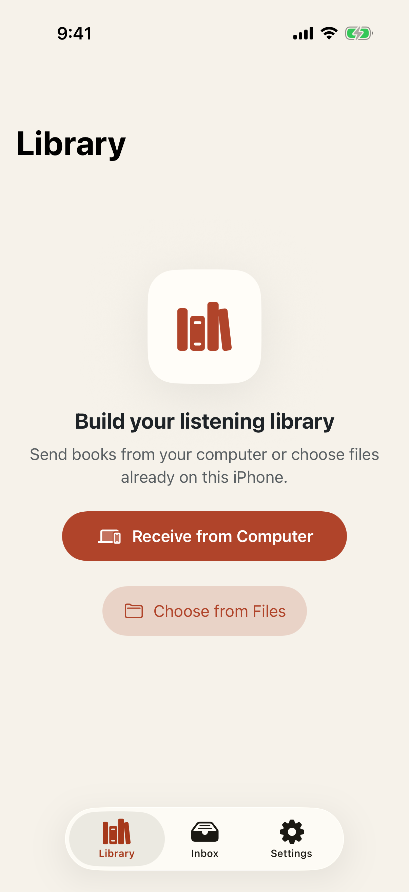
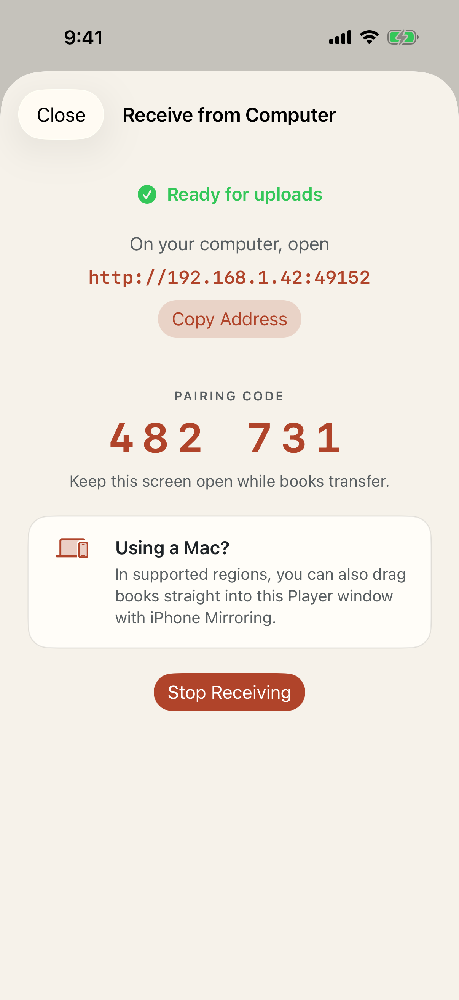
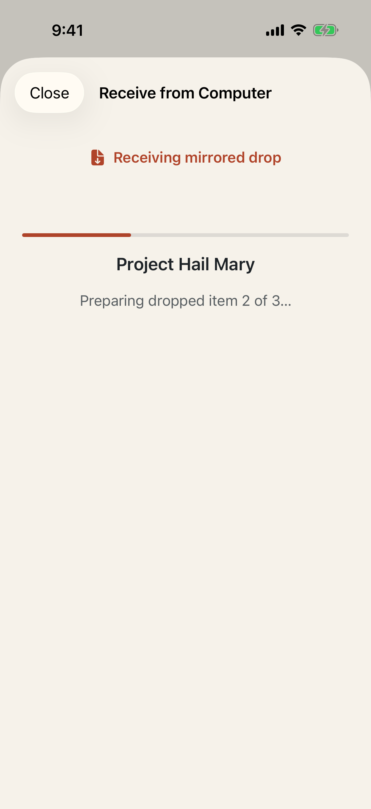

# Test: Player launches into an empty local library

> As a new listener, I want Player to open into a ready and understandable library so I can add my first audiobook.

## Deterministic preconditions

- Fixture: `empty-library`
- Xcode: 26.6
- Device: iPhone 17 on iOS 26.5, portrait, light appearance, standard Dynamic Type
- Locale and time zone: `en_CA`, `America/Toronto`
- Status bar: fixed at 9:41 AM, full battery, and full network indicators
- Animations: disabled by the E2E build configuration
- Network and clock data: unused by this story

## Player launches into the ready empty-library state

**Verifications:**

- [x] The Library screen is visible
- [x] The application reports the ready empty-library state
- [x] The empty state explains the next action
- [x] The primary computer receiver action is available
- [x] The on-device Files fallback is available
- [x] The Library tab is selected and available
- [x] The Inbox tab is available
- [x] The Settings tab is available
- [x] No mini-player appears without a book

## The receiver gives the computer one address and one short pairing code

**Verifications:**

- [x] The receiver is ready before the listener visits the computer
- [x] A copyable local-network address is shown
- [x] A six-digit pairing code is shown
- [x] Supported locales also see the optional iPhone Mirroring path

## A mirrored folder drop reports deterministic preparation progress on iPhone

**Verifications:**

- [x] The receiver reports the native mirrored-drop state
- [x] The listener sees progress while the dropped folder is materialized
- [x] The progress view identifies the book currently being received
