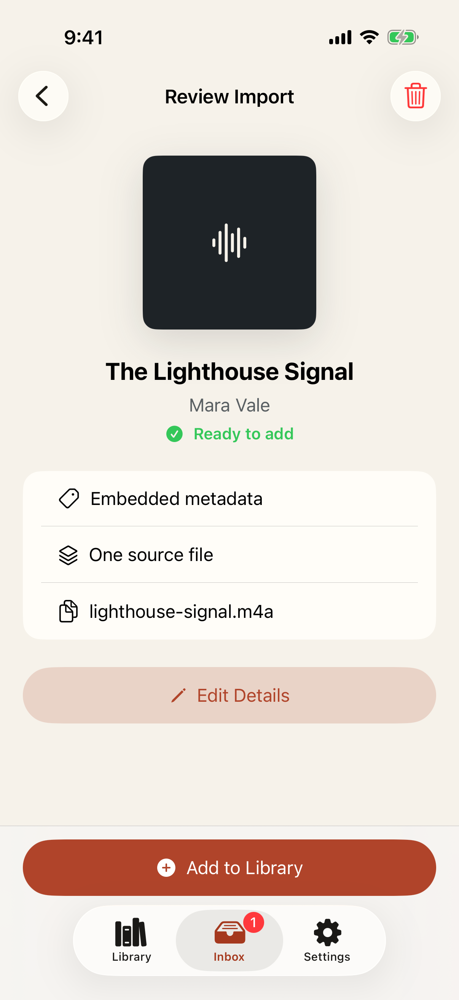
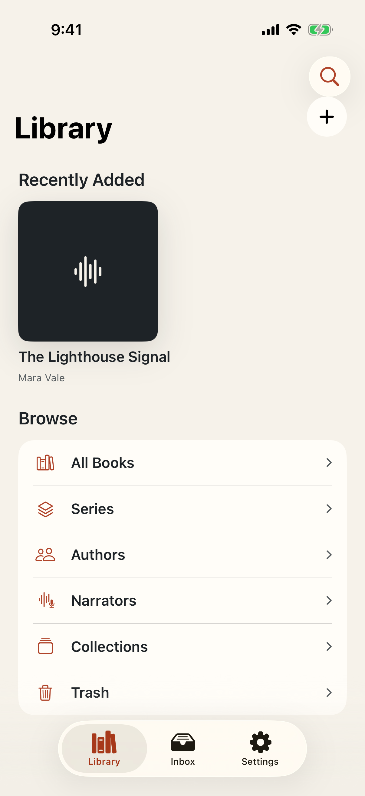
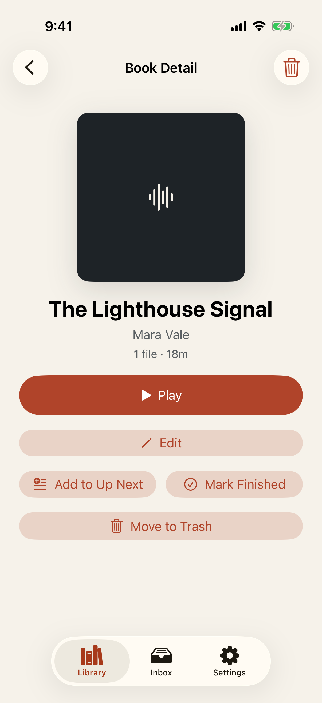
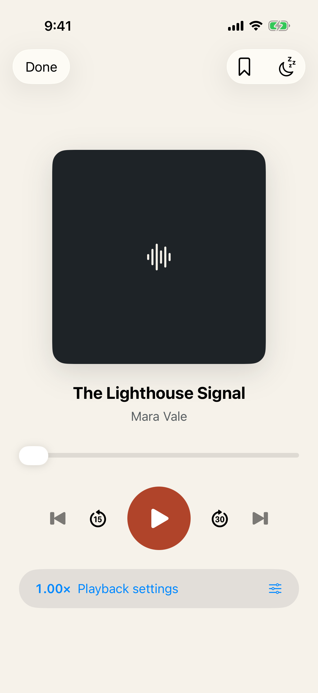
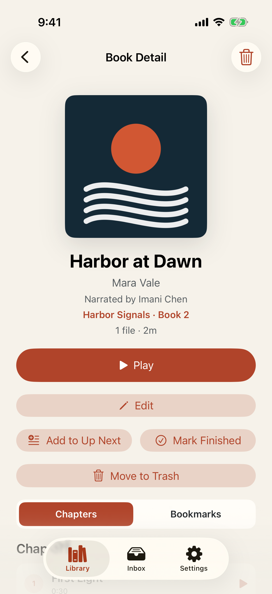
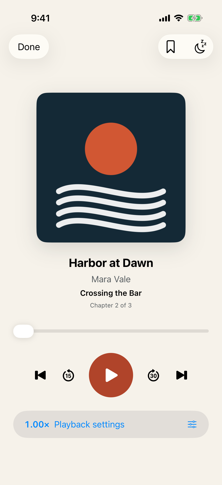

# Test: A local audiobook moves from Inbox to playback

> As a listener, I want to review one imported audiobook, add it to my library, and know its managed audio is ready to play.

## Deterministic preconditions

- Fixture: `single-audiobook-ready`
- Xcode: 26.6
- Device: iPhone 17 on iOS 26.5, portrait, light appearance, standard Dynamic Type
- Locale and time zone: `en_CA`, `America/Toronto`
- Status bar: fixed at 9:41 AM, full battery, and full network indicators
- Animations: disabled by the E2E build configuration
- Network and clock data: unused by this story
- Identifiers, metadata, duration, and import timestamps are fixed
- Playback uses the deterministic engine behind the production playback boundary

## The inspected audiobook is ready for review

**Verifications:**

- [x] The Review Import screen is visible
- [x] The inspected title is presented
- [x] The inspected author is presented
- [x] The pinned Add to Library action reports that it is ready
- [x] The primary action is visible, enabled, and directly tappable

## The committed audiobook appears in the local library

**Verifications:**

- [x] The Library reports exactly one committed book
- [x] The committed title is visible
- [x] The committed author is visible

## Book Detail exposes the playable managed audiobook

**Verifications:**

- [x] The Book Detail screen is visible
- [x] The audiobook has a Play action
- [x] The inspected asset count and duration are retained

## Now Playing has loaded and paused the managed audio

**Verifications:**

- [x] The deterministic engine acknowledges a paused loaded book
- [x] Now Playing retains the book identity
- [x] The transport remains available

---

# Test: Embedded audiobook metadata and chapters remain useful after import

> As a listener, I want an imported audiobook to retain its cover, contributors, series, and chapter boundaries so I can understand it and start at a chapter.

## Deterministic preconditions

- Fixture: `metadata-rich-book`
- Xcode: 26.6
- Device: iPhone 17 on iOS 26.5, portrait, light appearance, standard Dynamic Type
- Locale and time zone: `en_CA`, `America/Toronto`
- Status bar: fixed at 9:41 AM, full battery, and full network indicators
- Animations: disabled by the E2E build configuration
- Network and clock data: unused by this story
- The fixture models metadata parsed from a deterministic synthetic M4B
- The committed book has one asset and three embedded chapters
- Identifiers, chapter boundaries, artwork, duration, and contributors are fixed
- Playback uses the deterministic engine behind the production playback boundary

## Book Detail presents embedded contributors, series, cover, and chapters

**Verifications:**

- [x] The metadata-rich Book Detail screen is visible
- [x] The book exposes one M4B asset and three embedded chapters
- [x] The embedded title is visible
- [x] The embedded author is visible
- [x] The embedded narrator is visible
- [x] The embedded series is visible
- [x] The embedded cover artwork is retained
- [x] The first embedded chapter is navigable
- [x] The second embedded chapter is navigable

## Starting an embedded chapter opens Now Playing at its exact boundary

**Verifications:**

- [x] The deterministic engine acknowledges chapter 2 at 30,000 milliseconds
- [x] Now Playing names the current chapter
- [x] Now Playing gives chapter context
- [x] The chapter position remains adjustable
