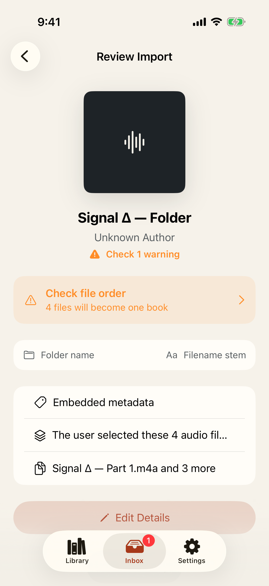
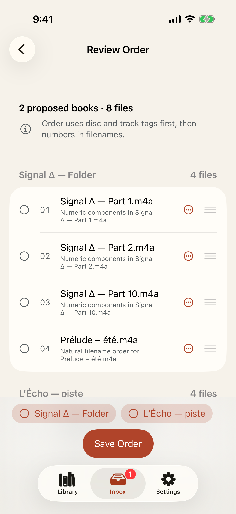
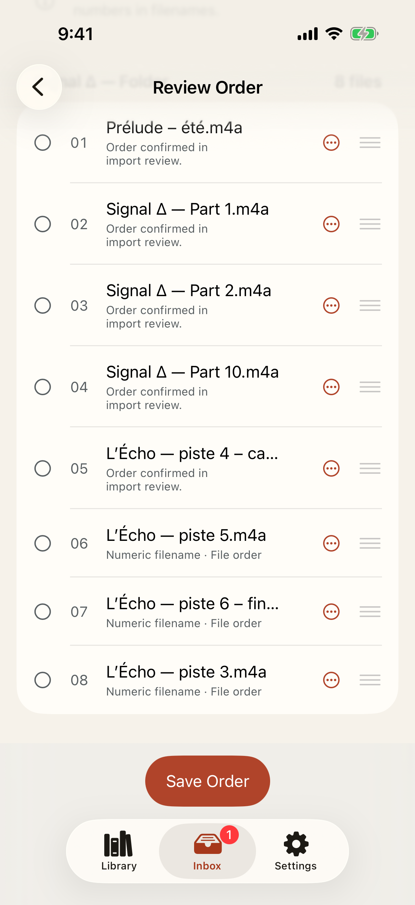
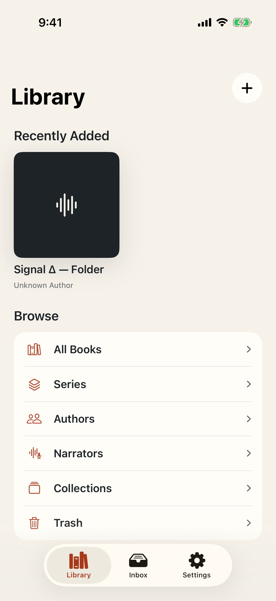

# Test: Messy Unicode files become one intentionally ordered audiobook

> As a listener importing a folder and several files, I want to understand Player's grouping guess, repair it, and commit one complete book.

## Deterministic preconditions

- Fixture: `messy-multifile-unicode`
- Xcode: 26.6
- Device: iPhone 17 on iOS 26.5, portrait, light appearance, standard Dynamic Type
- Locale and time zone: `en_CA`, `America/Toronto`
- Status bar: fixed at 9:41 AM, full battery, and full network indicators
- Animations: disabled by the E2E build configuration
- Network and clock data: unused by this story
- All eight audio files are generated tones with deterministic identifiers and checksums
- Acquisition supplies one folder plus four selected loose files through the production selection boundary
- Folder names, Unicode filename stems, and numeric components are the only grouping evidence
- The source fixture checksum is checked before acquisition and after atomic commit

## Review Import explains why the selection became two candidate books

**Verifications:**

- [x] The complete eight-file selection is present in two warning-bearing candidates
- [x] The proposal reports its folder, filename, and numeric-order evidence
- [x] Folder-name grouping evidence is visible
- [x] Unicode filename-stem grouping evidence is visible
- [x] The ordering problem links directly to Review Order

## Review Order preserves natural numeric order and every original file

**Verifications:**

- [x] Two candidates and all eight tracks require review
- [x] Numeric filename components place part 2 before part 10
- [x] Natural numeric ordering evidence is visible
- [x] The Unicode prelude is retained
- [x] The accented loose file is retained

## Move, reorder, split, and merge corrections produce one valid book

**Verifications:**

- [x] The corrected proposal is one valid eight-track book
- [x] The editor preserves the listener's complete curated order
- [x] The valid corrected order can be saved

## The corrected selection appears atomically as one complete library book

**Verifications:**

- [x] Exactly one book appears after the transaction commits
- [x] The populated Library exposes the stable corrected book
- [x] All eight assets committed together, staging cleared, and rollback remains available
