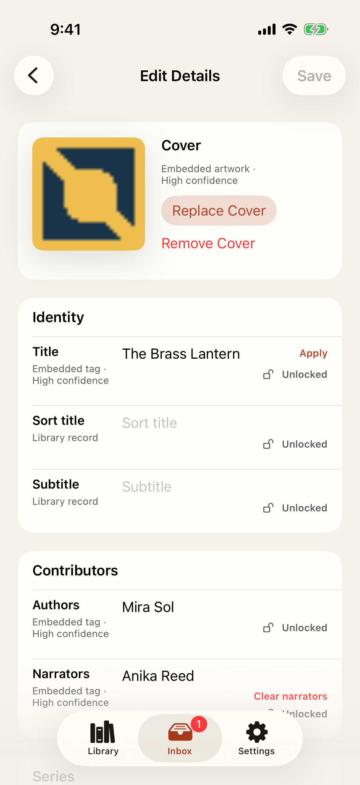
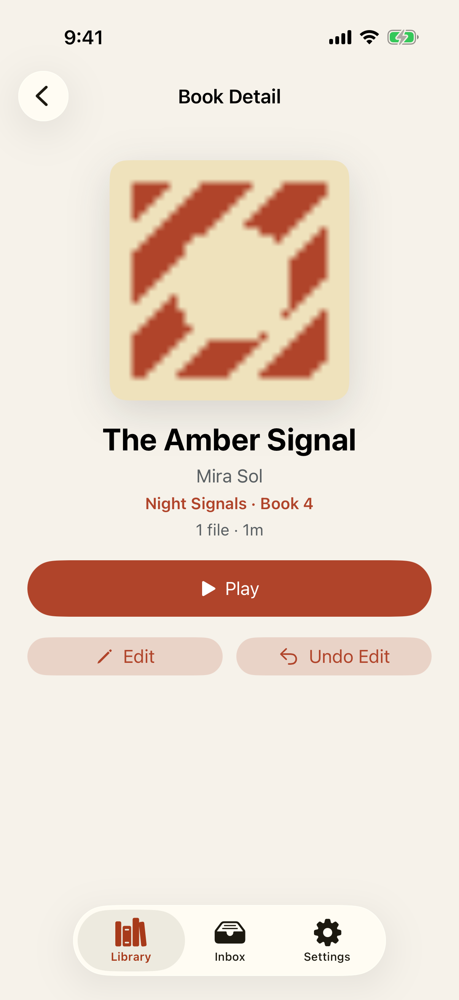
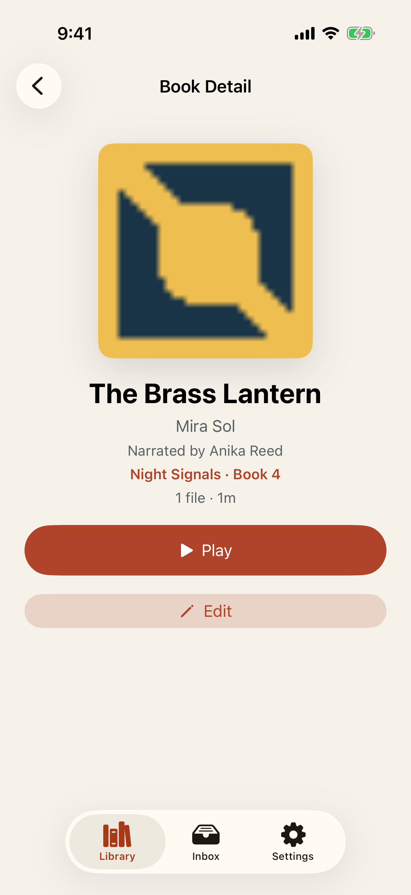

# Test: Metadata repair is explainable, reversible, and audio-safe

> As a listener, I want to understand proposed metadata, correct and lock it, replace its cover, and undo those changes without rewriting my audiobook audio.

## Deterministic preconditions

- Fixture: `synthetic-metadata-repair`
- Xcode: 26.6
- Device: iPhone 17 on iOS 26.5, portrait, light appearance, standard Dynamic Type
- Locale and time zone: `en_CA`, `America/Toronto`
- Status bar: fixed at 9:41 AM, full battery, and full network indicators
- Animations: disabled by the E2E build configuration
- Network and clock data: unused by this story
- The M4B and both covers are generated, checksum-verified legal test material
- All proposal values, provenance, confidence, locks, identifiers, and timestamps are fixed
- The source and managed audio checksums are observed from production storage
- No private metadata, local book, network provider, or photo library is used

## The editor explains every proposed value before repair

**Verifications:**

- [x] Title provenance and confidence are explicit
- [x] Author provenance and confidence are explicit
- [x] Narrator provenance and confidence are explicit
- [x] Series provenance and confidence are explicit
- [x] The embedded synthetic cover identifies its source
- [x] Opening metadata repair does not rewrite source audio

## The committed book retains the repaired values and locks

**Verifications:**

- [x] Book Detail reflects the exact repaired metadata state
- [x] Book Detail retains provenance after commit
- [x] Commit copied audio byte-for-byte without rewriting the source
- [x] The committed repair can be undone

## Undo restores the prior metadata and embedded cover

**Verifications:**

- [x] Undo restores every previous value and lock state
- [x] Undo restores the original provenance
- [x] Undo changes metadata only and leaves both audio copies byte-identical
- [x] The consumed undo action is removed
