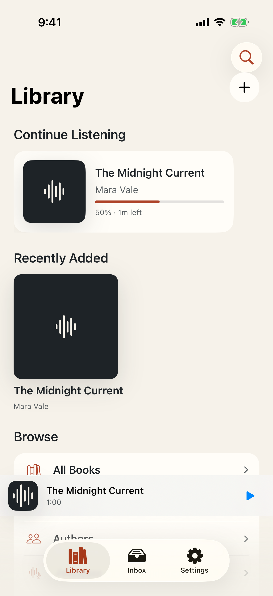
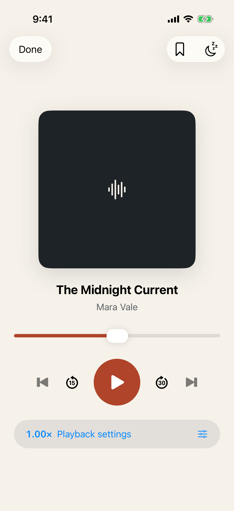
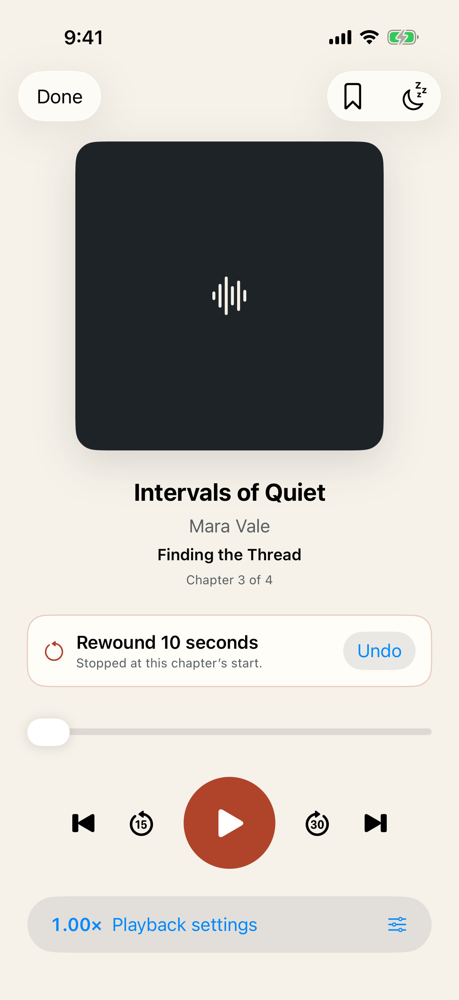
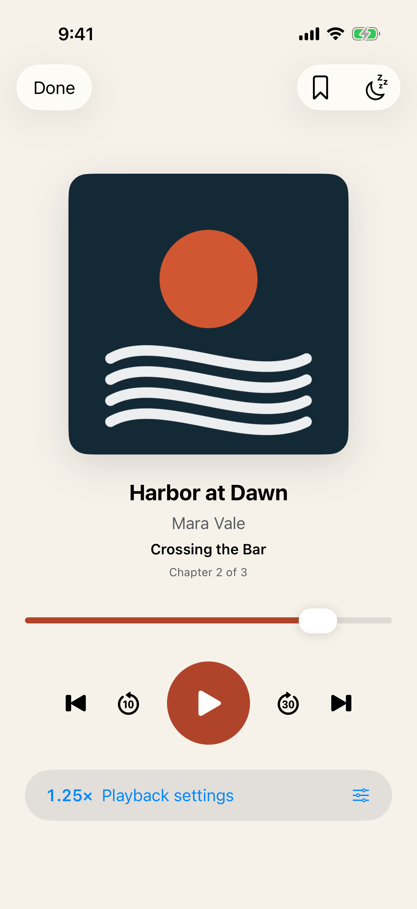

# Test: A paused listening position survives app termination

> As a listener, I want Player to return at audio I have already heard after I close and reopen the app.

## Deterministic preconditions

- Fixture: `committed-current-book`
- Xcode: 26.6
- Device: iPhone 17 on iOS 26.5, portrait, light appearance, standard Dynamic Type
- Locale and time zone: `en_CA`, `America/Toronto`
- Status bar: fixed at 9:41 AM, full battery, and full network indicators
- Animations: disabled by the E2E build configuration
- Network and clock data: unused by this story
- The fixture contains one committed 120-second book at chapter 1 and 12 seconds
- The first launch resets the fixture; the restore launch reuses the same durable E2E store
- The deterministic playback engine does not advance with wall-clock time
- A 50 percent slider seek resolves exactly to 60,000 milliseconds
- An orderly pause acknowledges and journals the position before returning

## Library restores the paused current book in its mini-player

**Verifications:**

- [x] The restored Library screen is visible
- [x] The durable library still contains exactly one book
- [x] The current book is available in the mini-player
- [x] The mini-player is paused at most 500 ms behind and never ahead of the acknowledged position

## Now Playing opens paused at the safely restored position

**Verifications:**

- [x] The restored Now Playing screen is visible
- [x] Now Playing is paused at most 500 ms behind and never ahead of the acknowledged position
- [x] The restored Play control is available
- [x] The restored position remains adjustable

---

# Test: Smart Rewind resumes safely and remains exactly undoable

> As a listener returning after time away, I want Player to rewind by a predictable amount without crossing the current chapter, explain the adjustment, and let me undo it exactly.

## Deterministic preconditions

- Fixture: `smart-rewind`
- Xcode: 26.6
- Device: iPhone 17 on iOS 26.5, portrait, light appearance, standard Dynamic Type
- Locale and time zone: `en_CA`, `America/Toronto`
- Status bar: fixed at 9:41 AM, full battery, and full network indicators
- Animations: disabled by the E2E build configuration
- Network and clock data: unused by this story
- The fixture contains one deterministic 180-second book with a logical chapter beginning at 100,000 milliseconds
- The injected clock reports exactly 600 seconds away for the photographed chapter-clamp case
- The durable paused position is 110,000 milliseconds and the 15-second tier clamps to the chapter start at 100,000 milliseconds
- The deterministic playback engine does not advance with wall-clock time

## Now Playing explains the durable chapter-clamped rewind before Undo

**Verifications:**

- [x] Now Playing is paused exactly at the safe 100,000 ms chapter boundary
- [x] The explanation identifies the original position, clamped target, elapsed absence, and applied transaction
- [x] A one-tap Undo remains available after process termination and relaunch

---

# Test: Listening controls follow durable global and per-book preferences

> As a listener, I want chapter navigation, configurable skips, speed, and scrubber context to stay tailored to each audiobook.

## Deterministic preconditions

- Fixture: `metadata-rich-book`
- Xcode: 26.6
- Device: iPhone 17 on iOS 26.5, portrait, light appearance, standard Dynamic Type
- Locale and time zone: `en_CA`, `America/Toronto`
- Status bar: fixed at 9:41 AM, full battery, and full network indicators
- Animations: disabled by the E2E build configuration
- Network and clock data: unused by this story
- The fixture contains one deterministic 120-second book with three chapters
- The deterministic playback engine acknowledges every transport seek without advancing wall-clock time
- The first launch writes library defaults and a complete per-book override through production persistence
- The second launch reuses the same durable store and managed media

## Now Playing restores the custom speed, skips, chapter scrubber, and position

**Verifications:**

- [x] The complete per-book override survived termination
- [x] The configured skip result restored at the acknowledged book position
- [x] Previous chapter is available
- [x] Next chapter is available
- [x] The custom backward skip is available
- [x] The custom forward skip is available
- [x] The chapter scrubber is available
