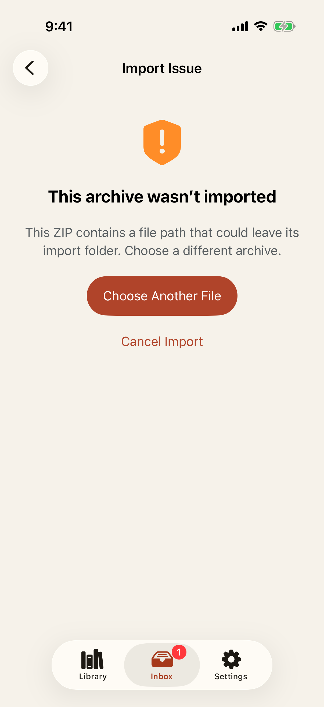
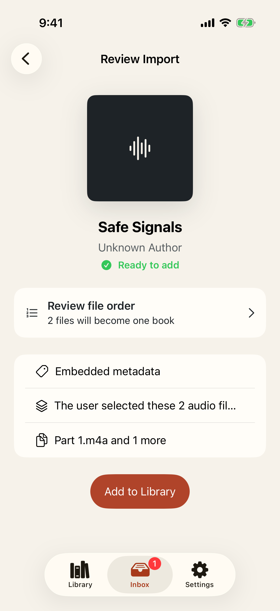

# Test: ZIP imports reject unsafe entries and keep recovery actionable

> As a listener importing archives, I want Player to reject unsafe content without touching my source and help me cancel, choose another file, or retry a temporary failure.

## Deterministic preconditions

- Fixture: `safe-zip-import`
- Xcode: 26.6
- Device: iPhone 17 on iOS 26.5, portrait, light appearance, standard Dynamic Type
- Locale and time zone: `en_CA`, `America/Toronto`
- Status bar: fixed at 9:41 AM, full battery, and full network indicators
- Animations: disabled by the E2E build configuration
- Network and clock data: unused by this story
- Every archive and payload is deterministic, synthetic, legal test material
- Archive limits are 32 entries, 131,072 bytes per entry, and a 20:1 expansion ratio
- Central-directory safety validation runs before any archive entry is extracted
- Source checksums and writes outside the isolated extraction root are observed by read-only probes

## An escaping archive path is rejected before extraction with safe next actions

**Verifications:**

- [x] The error identifies an unsafe path without exposing raw archive internals
- [x] No entry was extracted, the source is unchanged, and nothing escaped staging
- [x] The listener can choose a different archive
- [x] The listener can cancel safely
- [x] An unchanged path-traversal archive is not offered a meaningless retry

## Retrying a temporary inspection failure produces one safe reviewable book

**Verifications:**

- [x] Both safe archive tracks form one warning-free proposal
- [x] Retry retains source integrity and never writes outside extraction staging
- [x] The safe proposal can continue
