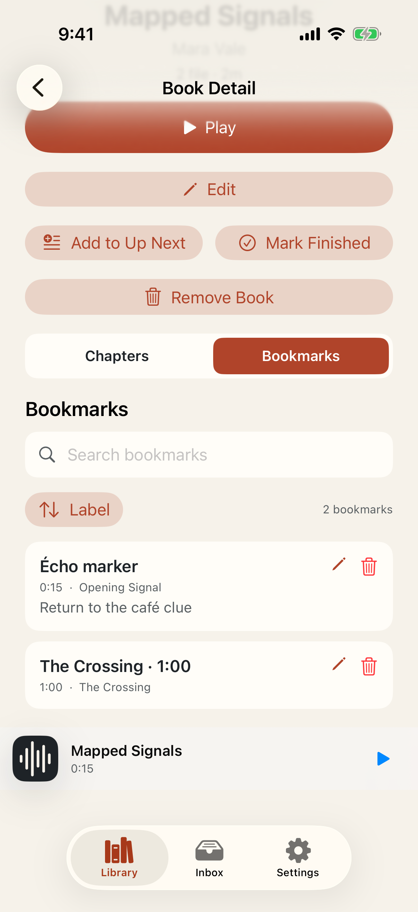
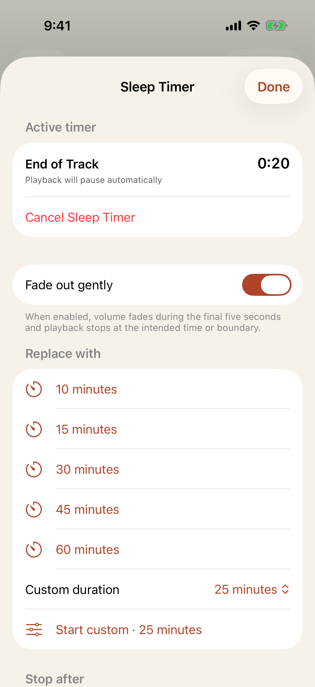
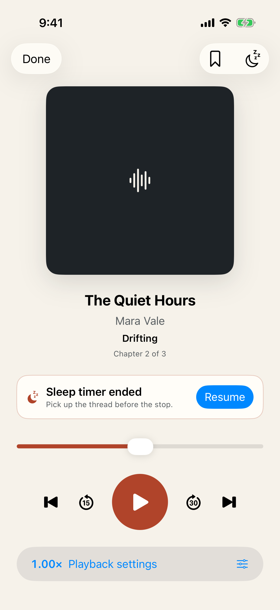

# Test: Bookmarks preserve, organize, and restore exact listening places

> As a listener, I want bookmarks with useful labels and notes that remain searchable, jumpable, and safely undoable across relaunches.

## Deterministic preconditions

- Fixture: `bookmarks`
- Xcode: 26.6
- Device: iPhone 17 on iOS 26.5, portrait, light appearance, standard Dynamic Type
- Locale and time zone: `en_CA`, `America/Toronto`
- Status bar: fixed at 9:41 AM, full battery, and full network indicators
- Animations: disabled by the E2E build configuration
- Network and clock data: unused by this story
- The fixture contains one deterministic 120-second book split into two 60-second synthetic assets
- Playback begins paused exactly at the 60,000 ms asset and chapter boundary
- The injected clock begins at epoch 1,700,030,000 and advances exactly 60 seconds before the second bookmark
- Generated production UUIDs begin at suffix 101 and resume after the highest durable UUID on relaunch

## Book Detail organizes edited bookmarks with their listening context

**Verifications:**

- [x] Bookmarks is the selected Book Detail section while Chapters remains adjacent
- [x] The cleared bookmark search shows both bookmarks in deterministic label order
- [x] The edited Unicode label and note remain attached to the exact first-asset position
- [x] The exact-boundary bookmark visibly retains its following asset and chapter context

---

# Test: Sleep Timer persists, stops exactly, and offers one contextual resume

> As a listener falling asleep, I want a durable timer that stops at the boundary I chose and offers one safe way back when I return soon.

## Deterministic preconditions

- Fixture: `sleep-timer`
- Xcode: 26.6
- Device: iPhone 17 on iOS 26.5, portrait, light appearance, standard Dynamic Type
- Locale and time zone: `en_CA`, `America/Toronto`
- Status bar: fixed at 9:41 AM, full battery, and full network indicators
- Animations: disabled by the E2E build configuration
- Network and clock data: unused by this story
- The fixture contains one deterministic 180-second book paused at 70,000 milliseconds
- Its first track ends at 90,000 milliseconds and its current chapter ends at 120,000 milliseconds
- The injected clock is fixed at epoch 1,700,020,000 until the E2E bridge evaluates a boundary
- The deterministic playback engine acknowledges seeks and pauses without advancing wall-clock time

## The active end-of-track timer remains clear after relaunch

**Verifications:**

- [x] The production timer sheet restores the same timer, target, fade preference, and active phase
- [x] The listener sees twenty seconds remaining until the exact 90,000 ms track boundary
- [x] The persisted timer remains cancellable

## Now Playing shows the completed sleep stop and one contextual Resume

**Verifications:**

- [x] Playback remains paused at the engine-acknowledged 90,000 ms stop after relaunch
- [x] The recent completed stop exposes its exact book, position, and ten-minute availability window
- [x] A prominent contextual Resume action is available exactly once
