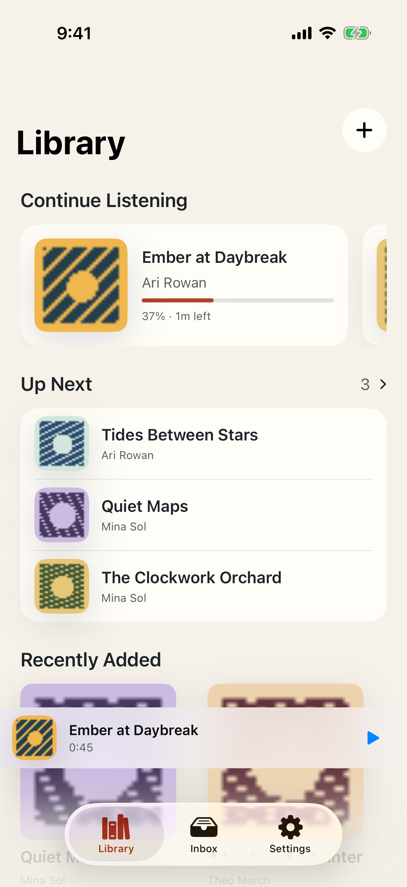
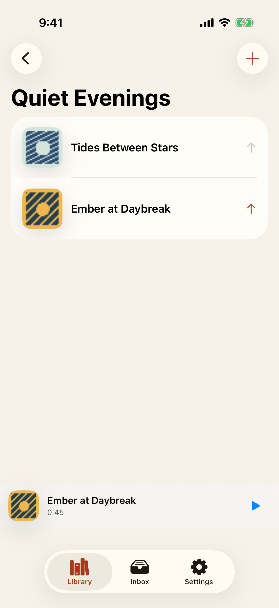
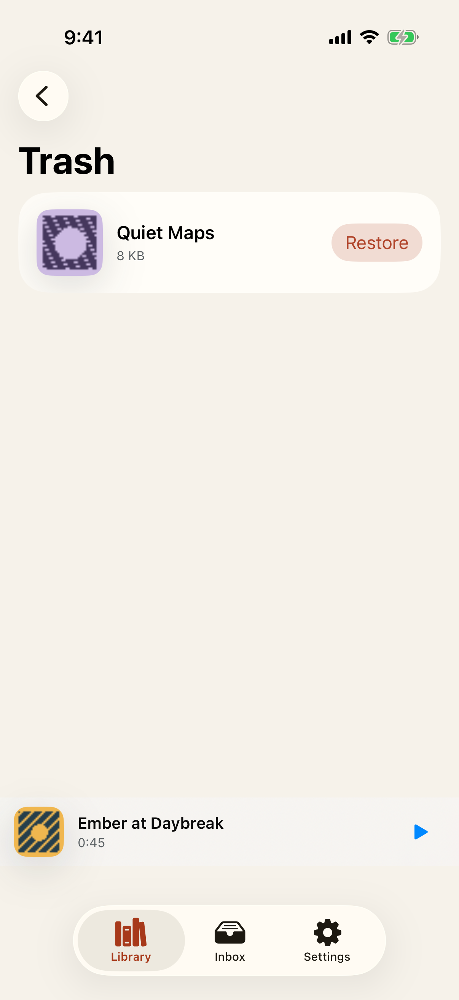
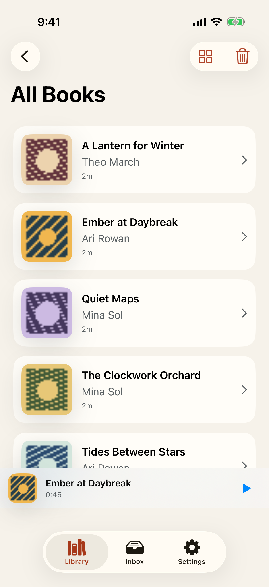

# Test: A populated audiobook library stays useful and recoverable

> As a listener, I want to resume, order, browse, collect, finish, and safely remove my books without losing my organization.

## Deterministic preconditions

- Fixture: `synthetic-populated-library`
- Xcode: 26.6
- Device: iPhone 17 on iOS 26.5, portrait, light appearance, standard Dynamic Type
- Locale and time zone: `en_CA`, `America/Toronto`
- Status bar: fixed at 9:41 AM, full battery, and full network indicators
- Animations: disabled by the E2E build configuration
- Network and clock data: unused by this story
- Five books, five covers, contributors, series, progress, and identifiers are fixed synthetic data
- All five managed assets are byte-identical copies of one tiny generated M4B; seeded book timelines are 120 seconds
- The fixture begins with two resumable books, three Up Next books, and one finished book
- The deterministic playback boundary does not advance with wall-clock time
- Collection, view-preference, finished, queue, and Trash changes use production persistence

## Library opens with deterministic Continue Listening and Up Next shelves

**Verifications:**

- [x] Every populated shelf exposes its exact production-model order
- [x] The current book can resume from Continue Listening
- [x] The ordered Up Next shelf is available
- [x] Recently Added begins with the newest book
- [x] Series browsing is available
- [x] Author browsing is available
- [x] Narrator browsing is available

## A custom collection retains the listener's manual book order

**Verifications:**

- [x] The named collection contains exactly two books in curated order
- [x] The first ordered collection book is visible
- [x] The second ordered collection book is visible

## Removing a book creates an exact recoverable Trash transaction

**Verifications:**

- [x] Trash reports one intact restorable managed asset
- [x] The removed book is identifiable in Trash
- [x] The exact removal transaction can be restored

## Restore returns the book and its organization while list preference persists

**Verifications:**

- [x] Restore atomically returns the book to its prior Up Next position
- [x] The list choice survives restart and Trash restore
- [x] The restored book is visible again
