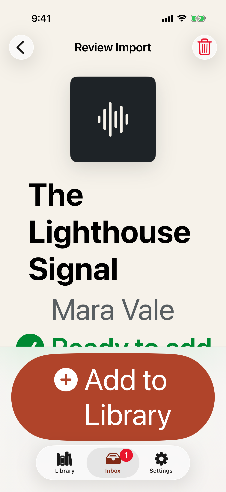
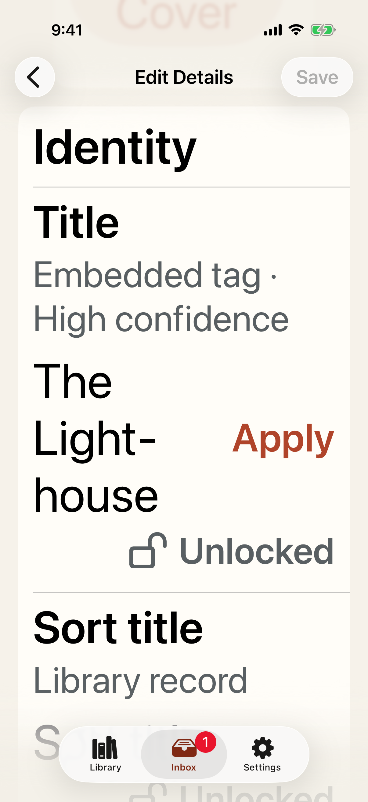
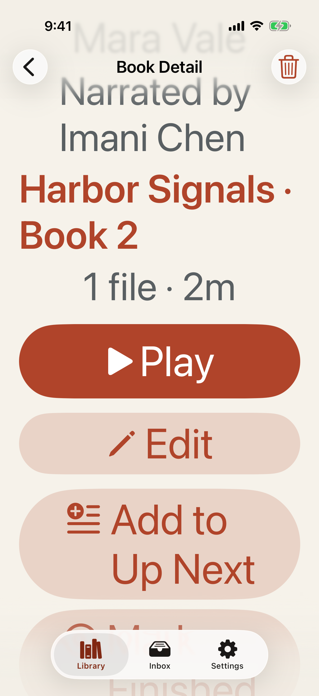
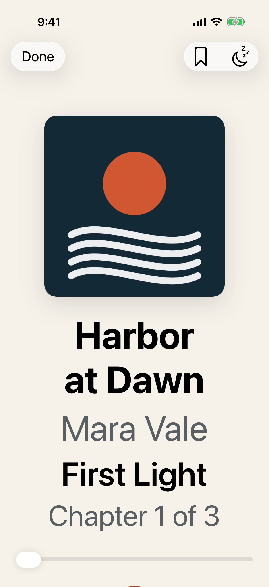
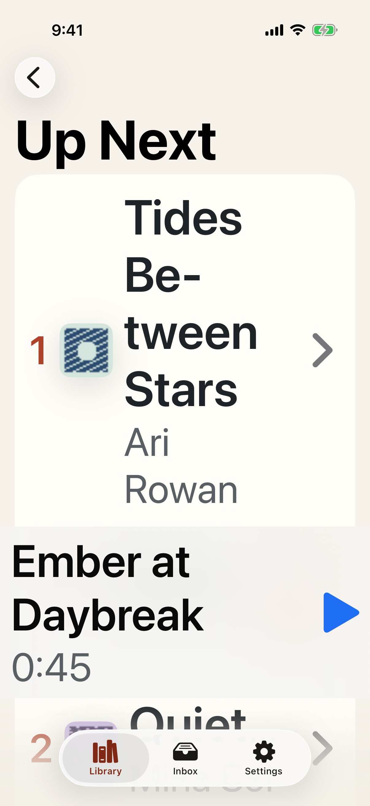
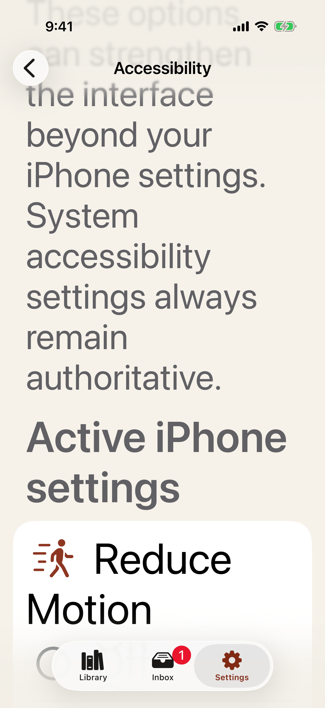

# Test: Core listening journeys remain accessible at the largest text size

> As a listener using accessibility features, I can import, repair, organize, and listen without losing a primary action.

## Deterministic preconditions

- Fixture: `single-audiobook-ready, metadata-rich-book, synthetic-populated-library, and deterministic receiver states`
- Xcode: 26.6
- Device: iPhone 17 on iOS 26.5, portrait, light appearance, Accessibility XXXL Dynamic Type, Increase Contrast
- Locale and time zone: `en_CA`, `America/Toronto`
- Status bar: fixed at 9:41 AM, full battery, and full network indicators
- Animations: disabled by the E2E build configuration
- Network and clock data: unused by this story
- The simulator uses Accessibility XXXL text and Increase Contrast
- Every asserted control has a unique human-readable accessibility label
- Ordering is verified through non-drag buttons, and the native playback slider remains adjustable
- Reduce Motion, Differentiate Without Color, and Bold Text are audited through SwiftUI environment adaptation and the Settings status summary

## Import review keeps its title and pinned primary action at Accessibility XXXL

**Verifications:**

- [x] The review screen exposes one named semantic container
- [x] The full audiobook title remains readable
- [x] Add to Library exposes its ready state without color alone
- [x] Add to Library is visible, enabled, named, and tappable

## Metadata fields reflow vertically instead of compressing their labels

**Verifications:**

- [x] The metadata editor has a stable semantic screen identity
- [x] The full Title field remains reachable
- [x] The explicit Apply action remains available
- [x] Save remains in the navigation bar

## Book Detail stacks identity and primary actions at the largest text size

**Verifications:**

- [x] Book Detail exposes its exact semantic state
- [x] The title is not truncated
- [x] Play remains reachable and directly tappable

## Now Playing scrolls to an adjustable timeline and reachable transport controls

**Verifications:**

- [x] Now Playing exposes its playback state
- [x] The listening timeline remains a native adjustable control
- [x] The timeline names elapsed and remaining listening time
- [x] Play or Pause remains visible and tappable
- [x] Skip Back has a named VoiceOver action
- [x] Skip Forward has a named VoiceOver action

## Up Next offers explicit labeled ordering controls without requiring drag

**Verifications:**

- [x] The ordered queue remains available
- [x] Move Later names the affected audiobook
- [x] Move Earlier names the affected audiobook

## Settings distinguishes app preferences from authoritative iPhone settings

**Verifications:**

- [x] Both app-specific display preferences persist in the model
- [x] The active system Increase Contrast setting is reported
- [x] System accessibility settings are presented separately

## The direct-import receiver remains scrollable and exposes its pairing details

**Verifications:**

- [x] The receiver reports a ready state without relying on color
- [x] The local address remains discoverable
- [x] The pairing code remains discoverable
