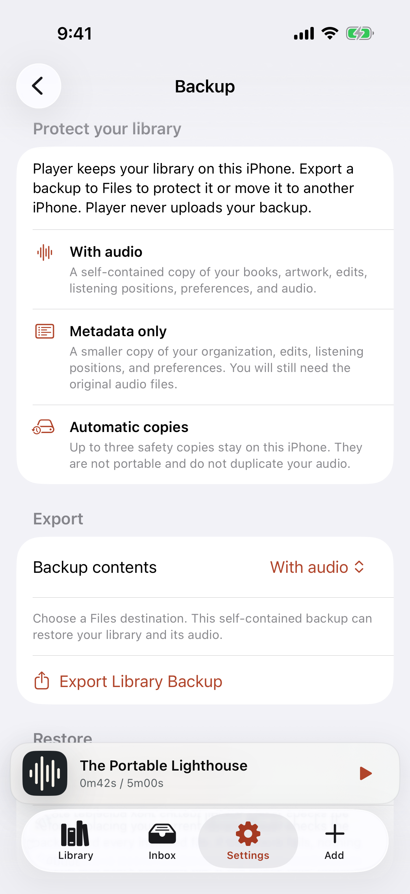
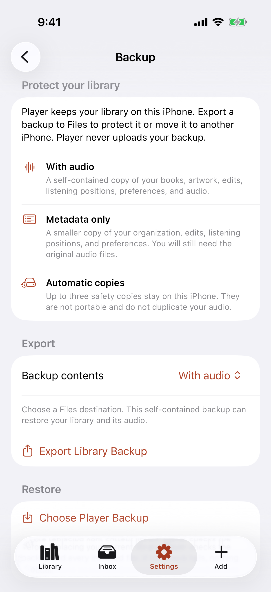

# Test: A complete local library travels in one verified backup

> As a listener, I want to export my library, clear this device, and restore the same playable book, progress, and bookmark without duplicate audio.

## Deterministic preconditions

- Fixture: `portable-backup`
- Xcode: 26.6
- Device: iPhone 17 on iOS 26.5, portrait, light appearance, standard Dynamic Type
- Locale and time zone: `en_CA`, `America/Toronto`
- Status bar: fixed at 9:41 AM, full battery, and full network indicators
- Animations: disabled by the E2E build configuration
- Network and clock data: unused by this story
- The fixture contains one synthetic M4B payload, artwork, progress, organization, and a bookmark
- Export and restore call the production package writer, streaming checksum verifier, and atomic media replacement
- The system document picker itself is represented by deterministic E2E controls; its production entry points remain visible above

## Backup choices explain portable media and local automatic copies

**Verifications:**

- [x] Backup leads with why a listener needs it
- [x] With audio is identified as the self-contained recovery choice
- [x] Metadata only makes its dependency on the original audio explicit
- [x] Automatic copies are distinguished from portable exports
- [x] A system-destination export begins here
- [x] A Player backup can be selected from Files
- [x] The deterministic production export action is available

## A media-inclusive package preserves one checksum-verified audio payload

**Verifications:**

- [x] The prepared package retains the complete catalog and exactly one managed audio file

## The fixture library and managed media are absent before restore

**Verifications:**

- [x] No catalog record or managed audio copy remains

## Restore returns the identical library only after integrity verification

**Verifications:**

- [x] Book, bookmark, listening position, and exactly one audio file are restored
