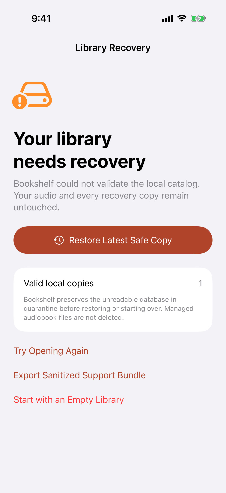
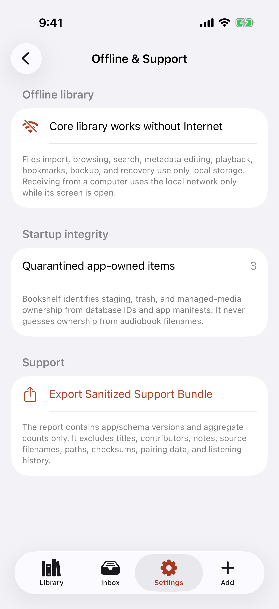
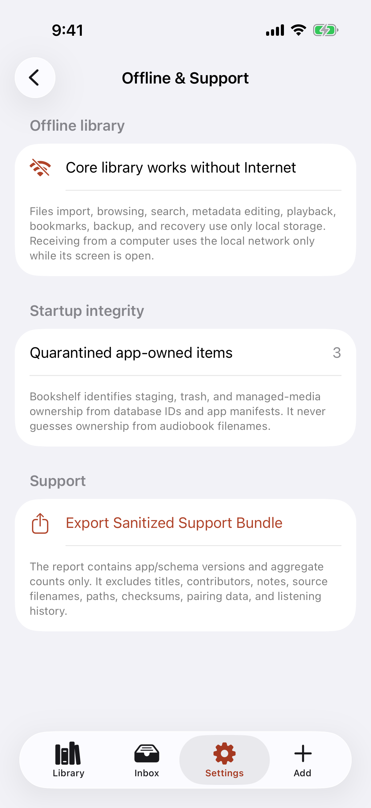

# Test: A damaged offline library recovers without exposing private data

> As a listener, I want Bookshelf to preserve a damaged catalog, recover the latest valid copy, reconcile interrupted storage, and create a support report that contains no audiobook identity or listening history.

## Deterministic preconditions

- Fixture: `offline-recovery`
- Xcode: 26.6
- Device: iPhone 17 on iOS 26.5, portrait, light appearance, standard Dynamic Type
- Locale and time zone: `en_CA`, `America/Toronto`
- Status bar: fixed at 9:41 AM, full battery, and full network indicators
- Animations: disabled by the E2E build configuration
- Network and clock data: unused by this story
- The primary catalog is corrupt and one rotating automatic copy is valid
- One app-owned managed-media directory, staging job, and trash transaction are absent from the catalog
- The fixture embeds forbidden private strings across title, contributor, bookmark, filename, and checksum fields
- No network interface or remote service is used by the recovery or diagnostic path

## A corrupt catalog opens a truthful recovery screen instead of terminating

**Verifications:**

- [x] The primary remains preserved and one independently validated local copy is offered
- [x] Recovery is explicit and does not silently replace the primary catalog
- [x] A sanitized support report remains available before recovery

## The valid library returns and unowned app directories move to quarantine

**Verifications:**

- [x] Managed, staging, and trash ownership is reconciled from IDs without filename guesses
- [x] The recovered library can create a sanitized support bundle

## The exported report proves offline readiness with allowlisted aggregate facts only

**Verifications:**

- [x] Title, contributor, bookmark text, filename, checksum, path, secret, and listening history are absent
