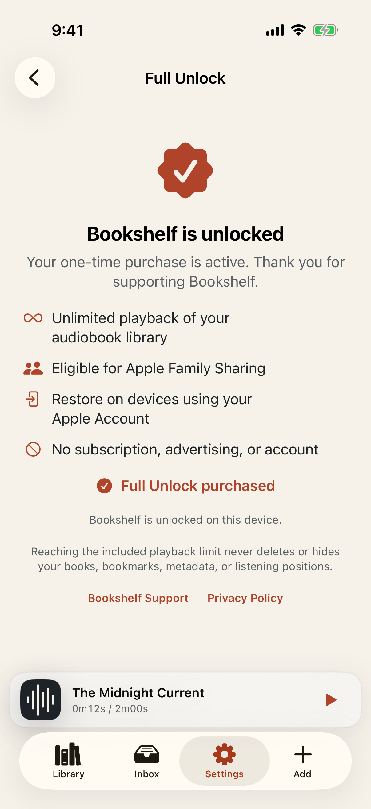

# Test: Bookshelf offers a clear one-time Full Unlock

> As a listener who used all included playback, I want a calm explanation, one-time price, restore path, and code redemption so I can keep listening without a subscription.

## Deterministic preconditions

- Fixture: `monetization-exhausted`
- Xcode: 26.6
- Device: iPhone 17 on iOS 26.5, portrait, light appearance, standard Dynamic Type
- Locale and time zone: `en_CA`, `America/Toronto`
- Status bar: fixed at 9:41 AM, full battery, and full network indicators
- Animations: disabled by the E2E build configuration
- Network and clock data: unused by this story
- The playback-only allowance is deterministically set to exactly 50 consumed hours.
- The production monetization manager uses a scripted sandbox StoreKit transport with isolated persistence.
- The simulator cannot deterministically complete Apple's offer-code sheet, so the test taps the production Redeem action and injects only its completion result.

## The exhausted state explains the permanent purchase without threatening library data

**Verifications:**

- [x] The Full Unlock screen is visible
- [x] The exact playback allowance is explained
- [x] The one-time purchase action is available
- [x] Purchase restoration is available
- [x] Offer-code redemption is available
- [x] The purchase model is explicit
- [x] Support is available before purchase
- [x] The privacy policy is available before purchase

## A successful non-consumable transaction permanently unlocks playback

**Verifications:**

- [x] The purchased entitlement is visible
- [x] The screen confirms ownership
- [x] The app no longer offers a duplicate purchase
