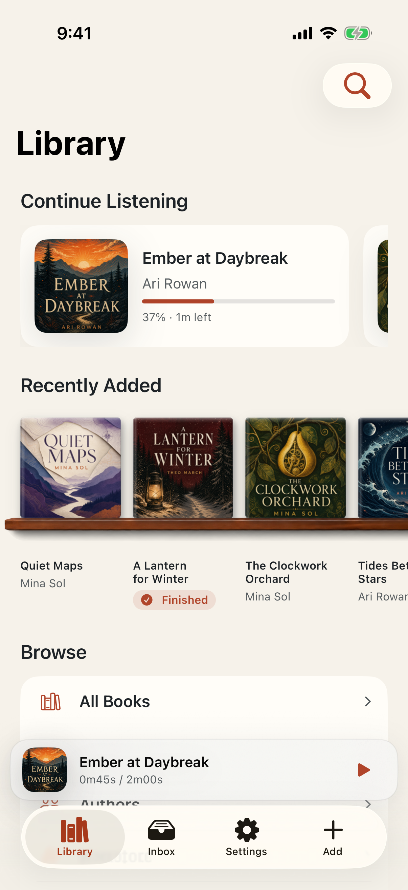
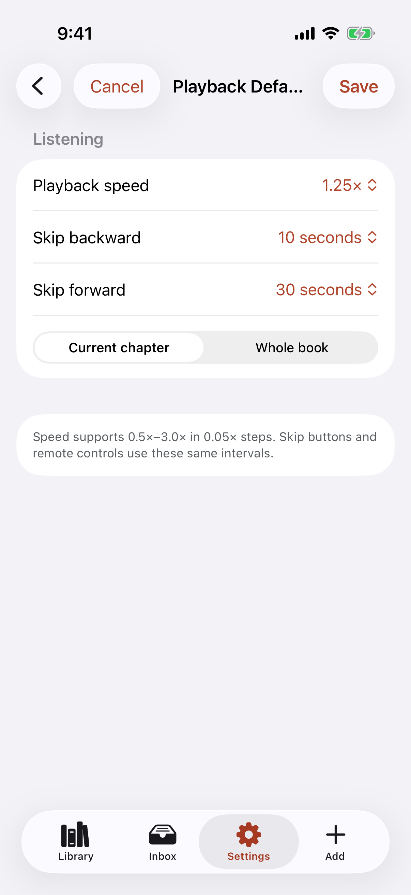
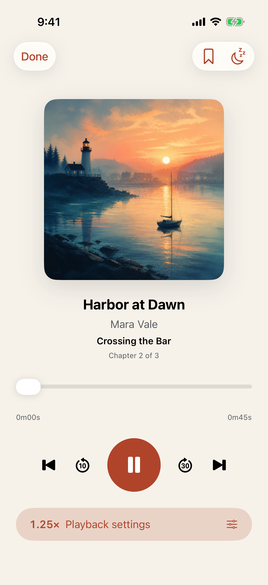
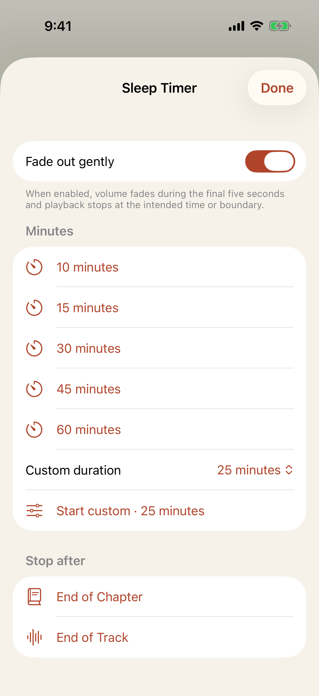
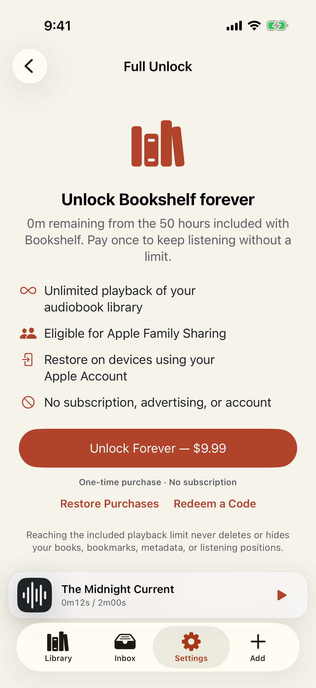

# Test: App Store and website marketing surfaces stay current

> As a prospective listener, I want the product page to show the real library, import, playback, and purchase experience.

## Deterministic preconditions

- Fixture: `marketing-surfaces`
- Xcode: 26.6
- Device: iPhone 17 on iOS 26.5, portrait, light appearance, standard Dynamic Type
- Locale and time zone: `en_CA`, `America/Toronto`
- Status bar: fixed at 9:41 AM, full battery, and full network indicators
- Animations: disabled by the E2E build configuration
- Network and clock data: unused by this story
- Every image uses fixed synthetic audiobook metadata and artwork.
- Harbor at Dawn uses committed, generated fictional cover artwork made for this marketing fixture.
- The listing and website build scripts consume the fresh ActualWalkthrough output from this story.
- No marketing screenshot is maintained as a second copied source file.

## The library gives owned audiobooks a warm, useful home

**Verifications:**

- [x] The Library screen is visible
- [x] Listening progress is immediately useful
- [x] Recent cover artwork is visible
- [x] The recent shelf section has distinct semantics
- [x] The current book stays within reach

## The private receiver accepts books through a browser on any computer

**Verifications:**

- [x] The receiver is ready
- [x] The ready state is backed by the production HTTP server
- [x] The pairing code is visible
- [x] Supported locales show iPhone Mirroring guidance
- [x] Files remains available

## iPhone Mirroring makes Finder drag-and-drop the fastest Mac path

**Verifications:**

- [x] The mirrored drop is being prepared
- [x] Import progress is visible
- [x] The incoming audiobook is named
- [x] The visible state is backed by the production drop progress callback

## Playback defaults make speed, skips, and seeking personal

**Verifications:**

- [x] The chosen defaults are visible
- [x] Playback speed is configurable
- [x] Backward skip is configurable
- [x] Forward skip is configurable

## Now Playing keeps chapters and custom controls close

**Verifications:**

- [x] Now Playing is visible
- [x] Previous chapter is available
- [x] Next chapter is available
- [x] Playback settings remain close

## The sleep timer adapts to minutes, chapters, or tracks

**Verifications:**

- [x] The Sleep Timer screen is visible
- [x] A 30-minute preset is available
- [x] End of chapter is available
- [x] Gentle fade is configurable

## The one-time Full Unlock is clear and subscription-free

**Verifications:**

- [x] The Full Unlock screen is visible
- [x] The one-time purchase is available
- [x] The purchase model is explicit
- [x] Purchase restoration is available
- [x] Support is available before purchase
- [x] The privacy policy is available before purchase
